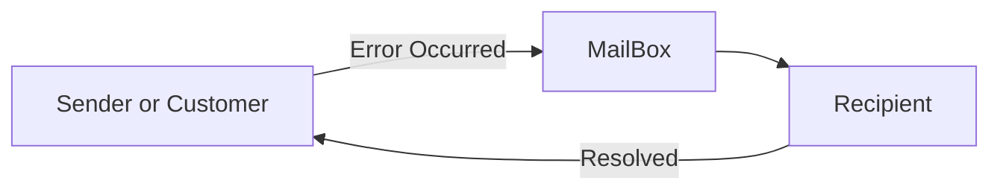

# Kraken: Leveraging Live Traffic Tests to Identify and Resolve Resource Utilization Bottlenecks in Large Scale Web Serviceb

## Terminologies

-  Feedback Loop

  공급자에게 컴플레인을 보내어 이에 대한 대처를 하게 함

## Abstract

-  현대 웹 서비스는 전세계적으로 분산되어 있는 데이터 센터에서 운용되고 있는 수백개의 시스템으로 이루어 짐
  Q. 수백 개의 시스템은 도대체 어떤 것이 있을까?
-  각 시스템은 capacity가 정해져 있으며, 데이터 센터 리소스를 효율적으로 사용하기 위해 환경 설정되고 조정됨
-  원래의 capacity 할당 모델을 유지하는 건 사용의 행동과 소프트웨어 구성요소가 끊임없이 발달하기 때문에 어려움
-  세 가지 이해가 이 연구의 동기부여가 됨: **(제대로된 이해가 필요)**
  1. 웹 서비스에 접근하는 실제 사용자 트래픽은 최신 타겟 워크로드를 제공
  2. 확장성 한계를 확인하기 위해 그 시스템을 경험적으로 테스트 할 수 있음
  3. 사용자 영향과 경험적 테스트의 운용 오버헤드는 실시간 트래픽을 조정할 수 있는 피드백 기반 자동화 툴을 통해 매우 줄일 수 있음
- 위 이해(통찰)를 통해, 하나 또는 그 이상 데이터 센터로 실시간 사용자 트래픽을 계속해서 옮김으로써 로드 테스트를 수행할 수 있는 새로운 시스템을 개발
- 이는 트래픽 이동 변경 사이에 피드백 루프를 통해 사용자 경험(latency)와 시스템 상태(error rate)를 모니터링함으로써 empirical test를 가능하게 함

