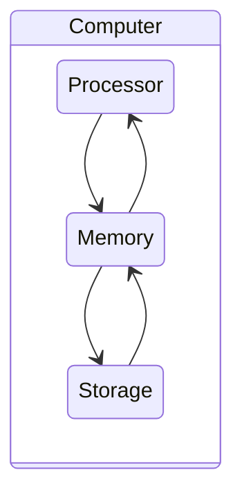
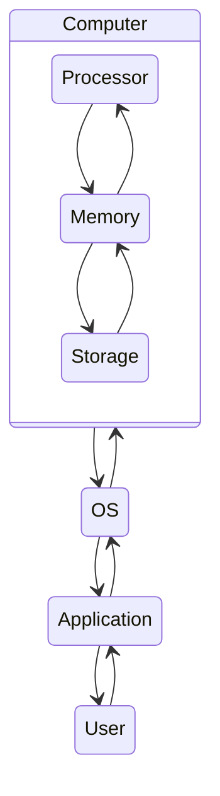
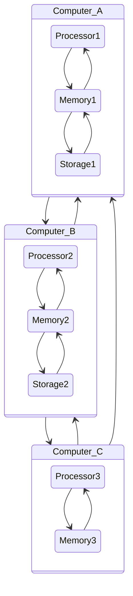

# 개요

## 컴퓨터 구조(Computer Architecture)

**컴퓨터**는 말 그대로 **어떤 계산(연산)을 해주는 장치**

- 그러한 연산을 하기 위해서는 **여러 장치**가 필요

  - 연산을 할 **Processor(처리기)**

  - 연산 과정을 기억할 **Memory(기억장치)**

  - 처리 결과를 저장할 **Storage(저장장치)**

  - 어떤 기능을 하는 다른 장치들이 추가될 수 있음

    > 네트워크 장치, 그래픽 처리 장치, 모니터, 마우스, 키보드 등

- 이러한 장치들을 **연결하는 선**이 필요

  > 버스, 스위치 등

- 아래와 같은 사항들에 대해 공부가 필요

  - 각기 어떤 구조로 이루어져 있는가?
  - 어떻게 하드웨어들은 연결되는가?
  - 총체적으로 어떻게 동작하는가?

## 운영체제(OS; Operating System)

- **컴퓨터 시스템**
  - 컴퓨터 하드웨어, 운영체제, 응용프로그램 및 사용자로 구분할 수 있음
  - 하드웨어, 소프트웨어, 데이터로 구성되어 있다고 볼 수 있음
- **운영체제**
  - 컴퓨터 시스템이 동작할 때 이들 자원을 적절하게 사용할 수 있는 방법을 제공
  - 즉, 응용 프로그램이 유용한 작업을 할 수 있는 환경을 제공
- 아래와 같은 사항들에 대해 공부가 필요
  - 컴퓨터 하드웨어는 어떻게 구성되어 있고, 동작하는가?
  - 운영체제의 구조와 동작

## 네트워크(Network)

- 여러 개의 컴퓨팅 노드(컴퓨터)들은 서로 연결되어 통신할 수 있음

- 아래와 같은 사항들에 대해 공부가 필요

  - 어떤 방식으로 연결되어 있는가?

    > 1. 유선
    > 2. 무선

  - 어떤 방식으로 데이터를 주고 받는가?

