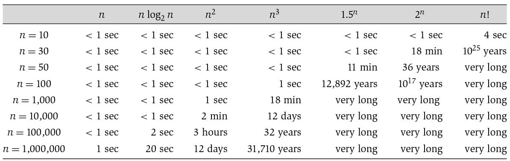

# Summary for Midterm

## What is the algorithm?

알고리즘이란 어떤 문제를 해결하는 방법을 말하는데, 이를 위해 다음과 같은 과정을 가진다.

1. 문제가 무엇인지 명확하게 정의한다.

2. 문제를 해결할 수 있는 알고리즘을 설계한다.

3. 설계한 알고리즘을 분석한다. 

   알고리즘 분석 사항에는 다음과 같이 여러 가지를 고려해야 한다.

   - 문제를 옳게 풀고 있는가?
   - 이 알고리즘이 문제를 해결하는데 얼마나 걸리는가?
   - 문제를 해결하기 위해 컴퓨팅 리소스 자원은 얼마나 필요한가?

#### Examples: Stable Marriage Problem with Gary-Shapley Algorithm

Stable Marriage Problem(SMP)는 두 개의 동일한 크기 집합을 `stable matching`을 찾는 문제이다. 

>  Stable Marraige 문제와 이를 해결할 수 있는 알고리즘 중 하나인 Gary-Shapley 알고리즘에 대해 좀 더 자세히 알고 싶으면 [링크](https://en.wikipedia.org/wiki/Stable_marriage_problem)를 참고하자.

## Analyzing Algorithm

 일반적으로 알고리즘은 그 문제를 정확하게 해결할 수 있어야 한다. 하지만 컴퓨터에서는 단순히 풀 수 있는 것만 중요한게 아니다. 컴퓨터에서 알고리즘은 입력으로부터 출력을 만들기 위한 어떤 계산을 수행하는 명령어 순서들로 이루어지는데, 그러므로 알고리즘을 분석하는 것 중 하나는 **“얼마나 많은 명령어들이 실행되느냐“**와 연관된다. 컴퓨터에서 명령어들의 실행은 어떤 명령어인지에 따라 실행 속도나 필요한 메모리 사이즈는 다를 수 있다. 

 컴퓨터에서 알고리즘 분석하는 것은 알고리즘의 정확성 및 알고리즘 실행을 위한 총체적인 실행 시간 및 필요한 메모리 사이즈 등 알고리즘이 얼마나 효율적인가를 측정하는 것이라 볼 수 있다. 그러므로 알고리즘 분석하는 것은 다음과 같은 요소들을 측정하는 것이라 할 수 있다.

- 정확성
- 효율성
  - 계산 시간
  - 필요한 메모리 크기

### Loop Invariants and Correctness

일반적으로 수학에서 반복적으로 계산되는 알고리즘, 예를 들어 수열과 같은 문제를 증명하기 위해서는 어떻게 할까? 

 피보나치 수열을 예를 들면, 피보나치 수열은 $a_{n+2} = a_{n+1} + a_n, (a_0 = 0, a_1=1, n >= 0) $ 와 같다. 이 수열을 증명하는 방법은 여러 가지가 있지만, 대표적인 방법은 [수학적 귀납법](https://en.wikipedia.org/wiki/Mathematical_induction)이다. 

하지만 컴퓨터 프로그래밍에서  `for`, `while` 등과 같은 **Loop** 문을 이용한 알고리즘을 증명하려면 어떻게 해야 할까? 

 이를 위해서 [**Loop Invariants(루프 불변성)**](https://en.wikipedia.org/wiki/Loop_invariant)를 이용할 수 있다. **Loop Invariants**은 **알고리즘을 수행하면서 변하지 않는 특성**을 말하는데, 이는 수학적 귀납법과 유사하지만 다른 점이 있다. 

일단 먼저 수학적 귀납법에 대해서 다시 한 번 보자. 수학적 귀납법은 반복적인 계산, 즉 알고리즘을 증명하기 위해서는 두 가지 단계가 수행된다. 세부적인 내용들에 대해서는 [링크](https://en.wikipedia.org/wiki/Mathematical_induction)를 확인하자.

1. **initial(base) case**
2. **induction(inductive) step**

**Loop Invariants**는 위 두 단계에서 **termination**이 추가된다. 이는 수학적으로는 무한히 계산할 수 있지만, 컴퓨터에서는 무한하게 계산할 수 없기 때문에 종료 조건 또는 시점이 필요하다.  따라서 **Loop Invariants**를 이용한 증명은 다음을 만족해야 한다.

**Loop Invariants**은 **알고리즘을 수행하면서 변하지 않는 특성**을 말한다.

1. **Initialization**
   루프의 첫번째 단계에 앞서 Loop Invariant를 만족해야 한다.
2. **Maintenance**
   만약 특정 반복 시 Loop Invariant를 만족하면, 그 다음 반복도 Loop Invariant를 만족해야 한다.
3. **Termination**
   루프가 종료될 시 Loop Invariant가 알고리즘이 그 문제를 옳게 풀었는지에 대한 정보를 줘야 한다.

이렇게만 설명하면 이해하기 힘드니, [Insertion Sort](#Example: Insertion Sort) 예제를 통해 깊게 이해해보자.

#### Example: Insertion Sort

[Analyzing Algorithm](#Analyzing Algorithm)에서 알아본 내용을 바탕으로 [**Insertion sort**](https://en.wikipedia.org/wiki/Insertion_sort)라는 알고리즘을 분석해보자.

> Insertion Sort가 무엇인지는 해당 [링크](https://en.wikipedia.org/wiki/Insertion_sort)를 참고하고, 여기선 어떻게 알고리즘 분석하는지만 알아본다.

Insertion sort 알고리즘에 대한 [pseudocode](https://en.wikipedia.org/wiki/Pseudocode)는 다음과 같다.

###### Pseudocode(의사 코드)

```pseudocode
// 오름차순 Insertion Sort
Insertion-Sort(A)
// 배열의 두 번째 인덱스부터 끝까지 반복
for j = 2 to A.length
	key = A[j]
	i = j - 1
	// 정렬하고자 하는 이전 요소들을 순회하면서 비교함
	while i > 0 and A[i] > key
		A[i + 1] = A[i]
		i = i - 1
	A[i + 1] = key
```

 Insertion Sort에서의 **Loop Invariants**는 “*배열 처음부터 배열 끝까지 모두 정렬되어 있다.*”이다. 그리고 알고리즘이 Loop Invariant가 만족하는지 확인해보자.

1. **Intialization**
   “루프를 첫번째 단계에 앞서”가 의미하는 바는

   ```pseudocode
   for j = 2 to A.length
   ```

   위와 같은 코드가 실행되기 전이다. 즉,  ` j = 1`일 때이다. 

   이때 A[1]에서부터 A[1]까지는, 즉 원소 한 개는 그 자체로 정렬되어 있으니 **Loop Variant**를 만족한다.

2. **Maintenance**
    `while` 문에서 `A[j]`의 올바른 위치를 찾기 위해서 `i`에 `j-1`를 대입하고, `A[i]`, `A[i-1]`, …와 같이 오른쪽으로  이동한다. 그리고 `A[j]`보다 작은 값을 찾으면 해당 위치에 `A[j]` 값을 삽입한다.

   따라서, `A[1, …, j]`는 항상 정렬되어 있고, 다음 번 반복 `j = j+1`일 때도 **Loop Invariant**를 만족한다.

3.  **Termination**
   루프는 `j == A.length + 1 `일 때 종료한다. 배열 `A[1, …, A.length]`까지는 정렬되고, 이는 배열 전체이니 전체 배열이 정렬되었다. 결과적으로 이 알고리즘은 참이다.

### Computational tractability

>  만약 어떤 문제와 그 문제에 대한 알고리즘이 존재하지만, 시간이 100년 이상 걸리면 어떻게 될까?

위의 의문점과 같이 어떤 알고리즘은 해결하고자 하는 입력 데이터가 증가하면 할수록 실행 시간이 기하급수적으로 늘어날 수 있다. 따라서 알고리즘은 현재 최신 기술의 컴퓨팅 자원들로 실제로 계산할 수 있어야 한다. 이러한 것을 의미하는 용어가 **comptutional tractability**이다.

컴퓨터에서 Computational Tractability를 정의할 수 있는 요소들은 어떤 것들이 있을 수 있을까? 
이 요소들은 입력 크기와 관계가 있다.

- **Computational Time**
- **Memory Size**

앞서 알아본 것을 통해, 알고리즘 설계란 계산할 수 있는 문제들에 대해 **효율적인** 알고리즘을 찾는 것이라고도 볼 수 있다. 

### Defining Efficiency

그럼 알고리즘의 효율성이란 무엇일까?

> “An algorithm is efficient if, when implemented, it runs quickly on real input instances”

위와 같은 정의는 알고리즘의 효율성을 정의하기에는 부적절한데, 그 이유는 다음과 같다.

- 알고리즘을 실행하는 환경에 따라서 실행 속도가 달라질 수 있다. 
  거대한 컴퓨팅 리소스를 가지고 있는 클라우드 시스템에서는 비효율적인 알고리즘이라도 매우 빠르게 실행될 수 있다.
- 실제 인스턴스의 입력 크기의 범위가 정해져 있지 않다.

따라서 효율성을 다음과 같이 정의한다.

> “A bound on the largest possible running time the algorithm could have all inputs of a given size N”

이 정의는 다음과 같은 특성을 가진다.

- **Platform-independent**
- **Instance-independent**
- **Predictive with respect to increasing input sizes**

즉, 내 컴퓨터에서 실행하든, 클라우드 시스템에서 실행하든, 어떤 거대한 슈퍼컴퓨팅을 이용해 실행하든 알고리즘을 실행시키기 위한 시간을 입력 크기에 따라서 대수적으로 예측할 수 있어야 한다.

#### Example: Insertion Sort2

Insertion Sort를 예제로 더 깊게 이해해보자.


알고리즘의 의사코드가 있고 그 옆에는 `cost`와 `times`가 있다. 

- `cost`  : 그 명령어를 실행시키기 위해 걸리는 시간, 이는 실행 환경이나 명령어에 따라 다를 수 있다.
- `times`: 그 명령어를 실행시킨 횟수

명령어는 각 명령어마다 `cost`와 `times`를 곱하여 해당 명령어의 총 실행 시간을 구한 후, 이를 더해 총 실행시간을 구할 수 있다.
$$
T(n) = c_1n + c_2(n-1) + c_4(n-1) + c_5\sum_{j=2}^{n}t_j + c_6\sum_{j=2}^{n}(t_j-1) + c_7\sum_{j=2}^{n}(t_j-1) + c_8(n-1) \\
$$

$$
Best\ Case: t_j = 1,\ Linear\ Function\\
T(n)=c_1n+c_2(n-1)+c_4(n-1)+c_5(n-1)+c_8(n-1) \\
 =(c_1+c_2+c_3+c_5+c_8)n - (c_2+c_4+c_5+c_8)
$$

$$
Worst\ Case: reverse\ sorted\ order,\ Quadratic\ function\\
T(n)= {1\over2}(c_5 +c_6+c_7)n^2 + (c_1+c_2+c_4+{c_5\over2}-{c_6\over2}-{c_7\over2}+c_8)n - (c_2+c_4+c_5+c_8)
$$

위의 계산한 식을 보면, `Best Case`는 $cn+d$이지만, `Worst Case`는 $n^2$이다. 따라서 어떤 입력이냐에 따라서 실행 시간이 달라질 수 있다. 그 외에도 `Average Case`가 있으며, 나머지 경우들과 비교 분석할 수 있다.

#### Worst- vs Average-case Analysis

앞서 살펴본 것과 같이 입력값에 따라서 알고리즘은 실행 시간을 대수적으로 표현했을 때 다를 수 있다. `Best Case`는 입력 값이 가장 좋을때만 살펴보는 것은 여러 문제점이 발생할 수 있다. 따라서 `Average Case` 또는 `Worst Case`로 알고리즘 효율성을 비교 분석할 수 있다.

먼저, **average-case anaylsis**는 무작위의 인스턴스들의 알고리즘 실행 시간들의 평균을 구하여 분석한다. 하지만 average-case가 무엇인지 수학적으로 정의하는 것이 매우 어렵다. **worst-case anaylsis**도 마찬가지로 무엇이 가장 **worst-case**인지 규명하기 힘들지만, 이에 못지않게 안 좋은 시나리오를 고려하여 구한다. 이는 **비관적 분석**을 통해 **안정성 보장**을 할 수 있고, 하나의 입력을 통해 이를 구할 수 있다. 또한 많은 경우에 **worst-case**가 **average**와 동일하다. 

따라서 우리들은 알고리즘 분석을 할 때 **worst-case analysis**를 주로 이용하며, 이를 이용해 알고리즘의 효율성을 다시 정의할 수 있다.

> “An algorithm is efficient if it achieves quantitatively better worst-case performance, at an analytic level, than [brute-force search](https://en.wikipedia.org/wiki/Brute-force_search)”

#### Polynomial Time

다항식(Polynomial)은 다음과 같은 형태의 표현식이다.
$$
a+bx+cx^2+...+dx^{n-1}+ex^n
$$

> In [mathematics](https://en.wikipedia.org/wiki/Mathematics), a **polynomial** is an [expression](https://en.wikipedia.org/wiki/Expression_(mathematics)) consisting of [variables](https://en.wikipedia.org/wiki/Variable_(mathematics)) (also called [indeterminates](https://en.wikipedia.org/wiki/Indeterminate_(variable))) and [coefficients](https://en.wikipedia.org/wiki/Coefficient), that involves only the operations of [addition](https://en.wikipedia.org/wiki/Addition), [subtraction](https://en.wikipedia.org/wiki/Subtraction), [multiplication](https://en.wikipedia.org/wiki/Multiplication), and non-negative [integer](https://en.wikipedia.org/wiki/Integer) [exponentiation](https://en.wikipedia.org/wiki/Exponentiation) of variables.
>
> Sources: https://en.wikipedia.org/wiki/Polynomial

이를 이용해서 알고리즘의 효율성을 정의하기도 한다.

> “An algorithm is efficient, if it has a polynomial running time”

[알고리즘이 다항식 시간이라하면 **tractable** 하다고 한다](https://en.wikipedia.org/wiki/Time_complexity#Polynomial_time). 입력 크기에 따라서 여러 다항식의 실행시간을 한번 살펴보자.



### Asymptotic Order of Growth

알고리즘 실행 시간 측정하는 법은 앞선 [Insertion Sort 예제](#Example: Insertion Sort2)에서 살펴보았다. Insertion Sort의 `Worst-Case` 경우는 다음과 같다.
$$
T(n)= {1\over2}(c_5 +c_6+c_7)n^2 + (c_1+c_2+c_4+{c_5\over2}-{c_6\over2}-{c_7\over2}+c_8)n - (c_2+c_4+c_5+c_8)
$$
이를 다시 표현하면 다음과 같다.
$$
T(n)= an^2 + bn - c
$$
위의 입력 크기에 따른 다항식들의 실행 시간에서 살펴봤듯이, 입력 크기가 매우 커지면 차수가 낮은 것들이나 상수 값은 크게 의미가 없어져 $n^2$만 유의미하다. 이러한 특성들을 이용해 알고리즘 실행 시간의 **bound**를 정하여 표현할 수 있으며, 이런 표기법을 **Asymptotic Notation(점근 표기법)**이라 한다.

**Asymptotic Notation**에서는 **Worst-case Running Time**만을 이용하며, 이는 $T(n)$으로 표기한다. 
**Asymptotic Notation**은 크게 세 가지 표기 방법이 있다.

> 잘 설명되어 있는 [블로그](https://ratsgo.github.io/data%20structure&algorithm/2017/09/13/asymptotic/) 참고

#### **Asymptotic upper bound(점근 상한)**


> source: https://www.programiz.com/dsa/asymptotic-notations
>
> 위의 그래프의 $x$ 축은 입력 크기 $n$ 이며, $y$ 축은 실행 속도이며, $f(n) = T(n)$ 이다.

점근 상한 표기법은 $f(n) = O(g(n))$과 같이 표현하며, 이는 $n_0$보다 큰 어떤 입력이 주어지더라도 $cg(n)$보다 $f(n)$ 실행속도가 같거나 더 빠를 때 표현하는 방법이다.
$$
f(n) = O(f(n)),\ when\ c>0\ and\ n_0\geq0,\ for\ all\ n\geq n_0,\ T(n) \leq cf(n)​
$$


#### **Asymptotic lower bound(점근 하한)**


> source: https://www.programiz.com/dsa/asymptotic-notations
>
> 위의 그래프의 $x$ 축은 입력 크기 $n$ 이며, $y$ 축은 실행 속도이며, $f(n) = T(n)$ 이다.

점근 하한 표기법은 $f(n) = \Omega(g(n))$과 같이 표현하며, 0보다 큰 입력 크기가 주어질 때 어떤 기점($n_0$)으로 $cg(n)$보다 $ f(n)$ 실행속도가 같거나 더 느릴 때 표현하는 방법이다.
$$
f(n) = \Omega(f(n)),\ when\ c>0\ and\ n_0\geq0,\ for\ all\ n\leq n_0,\ f(n) \geq cg(n)
$$

#### **Asymptotically tight bounds(점근적 상한과 하한의 교집합)**


> source: https://www.programiz.com/dsa/asymptotic-notations
>
> 위의 그래프의 $x$ 축은 입력 크기 $n$ 이며, $y$ 축은 실행 속도이며, $f(n) = T(n)$ 이다.

점근 상한과 하한의 교집합 표기법은 $f(n) = \Theta(g(n))$과 같이 표기하며, 0보다 큰 입력 크기가 주어질 때 어떤 기점($n_0$)으로 $c_2g(n)$보다 $f(n)$ 실행속도가 같거나 더 빠르고 $c_1g(n)$보다는 같거나 느릴 때 표현하는 방법이다.

#### Properties

##### Transivity

- $if\ f=O(g)\ and\ g=O(h),\ then\ f=O(h)$
- $if\ f=\Omega(g)\ and\ g=\Omega(h),\ then\ f=\Omega(h)$
- $if\ f=\Theta(g)\ and\ g=\Theta(h),\ then\ f=\Theta(h)$

##### Sum of functions

- $When\ f=O(g)\ and\ g=O(h),\ then\ f+g=O(h)$
- $When\ g=O(f),\ then\ f+g=O(f)$

## Divide and Conquer

세상에는 계산할 수 있는 다양한 문제들이 존재하며, 이런 문제들은 `brute-force` 방식으로 해결할 수 있다. 이런 문제들은 `brute-force` 방식으로 풀 수도 있지만, 그보다 더 효율적으로 풀 수 있다. 그런 방법 중 하나가 문제들의 패턴을 파악하여 해결하는 것이다. 문제의 패턴은 다양하게 있을 수 있지만, 그 중 대표적인 패턴은 **반복(recursion)**이다. 

반복하는 문제 중 하나는 **Merge Sort**가 있으며, 이를 해결하기 위한 좋은 방법 중 하나는 **Divide and Conquer**이다. **Divide and Conquer**은 문제를 세 가지 단계를 적용하여 반복적으로 해결한다.

1. **Divide**
   문제를 더 작은 인스턴스로 나눈 부분 문제로 만든다.
2. **Conquer**
   부분 문제가 충분히 작다면, 그 문제를 간단한 방법으로 해결한다.
3. **Combine**
   부분 문제의 해결물들을 다시 상위 문제로 통합하여 본래의 문제까지 해결한다.

이를 [Merge Sort](#Example: Merge Sort)를 이용해 좀 더 깊게 이해해보자

#### Example: Merge Sort

[Merge Sort](https://en.wikipedia.org/wiki/Merge_sort)에 대한 자세한 것들은 링크를 참고하자.

**MergeSort**는 다음과 같이 동작한다.


> Source: https://en.wikipedia.org/wiki/Merge_sort

1. 크기가 충분히 작아질 때까지 부분 문제로 나눈다.**(Divide)**

   ```pseudocode
   MergeSort_Partition(A)
   n = length(A)
   if n <= 1 then
   	return A
   left = MergeSort_Partition(A[1:n/2])
   right = MergeSort_Partition(A[n/2+1:n])
   return Merge(left, right)
   ```

2. 비교를 하며 정렬한다.**(Conquert and Combine)**

   ```pseudocode
   Merge(left, right)
   m = length(left) + length(right)
   temp = array(m)
   i = 1, j = 1
   for k = 1 to m 
   	if left[i] < right[j]
   		s[k] = left[i]
   		i = i + 1
   	else 
   		s[k] = right[j]
   		j = j + 1
   ```

### Advantages

Divide and conquer를 통해 얻을 수 있는 이점들은 다음과 같다.

- 어려운 문제를 효율적으로 해결할 수 있다.

- 병렬적으로 해결할 수 있다.

- 캐시 메모리를 이용하면 더욱 빠르게 해결할 수 있다.

- Roundoff control 할 수 있다.

  > 1.34+0.33+0.35+0.36 → 1.7 + 0.35 + 0.36 → 2.1 + 0.36 → 2.5
  > (1.34+0.33)+(0.35+0.36) → 1.7 + 0.7 → 2.4
  > Actual value = 2.38

### Recurrence

 그럼 분할 정복 알고리즘 중 분할 단계에서는 **어느 단계까지 분할해야 할까?** 이를 일컫는 용어를 **Recurrence**라 한다. 그리고 **recurrence**는 다음과 같이 두 가지 단계가 있을 수 있다.

**Recurrence**

- **base case**: 더 이상 분할할 수 없는 단계
- **recursive case**: 분할할 수 있는 단계

예를 들어 Merge sort의 Recurrence는 다음과 같다.
$$
T(n) = 
	\begin{cases}
        \Theta(1) & \quad\text{if} \ n = 1 \\
        2T(n/2) + \Theta(n) & \quad\text{if} \ n>1 \\
	\end{cases}
$$

#### Solving Recurrence

어떤 문제를 분할 정복 알고리즘으로 풀 수 있다면, 그 알고리즘에 대한 **Recurrence**를 구할 수 있다. 그리고 **Recurrence**를 풀어서 알고리즘 실행 시간을 확인할 수 있다. **Recurrence** 풀 수 있는 세 가지 방법이 있다.

- **Substitution method**
- **Recursive-tree method**
- **Master method**

이 세 가지 방법은 아래 예를 통해서 알아보자.

#### Example: Maximum-subarray Problem; Stock Market

[Maximum-subarray Problem](https://en.wikipedia.org/wiki/Maximum_subarray_problem)은 일차원 배열에서 요소들의 합이 가장 큰 연속적인 부분배열을 구하는 것이다. 그 중 하나의 예로 **Stock Market** 문제를 살펴보자


위 그림을 보면 0일부터 17일에 대한 주식 가격 및 변화량이 나온다. 그럼 Stock Market 문제는 “**주식을 어떤 날에 사서 어떤 날에 팔아야 가장 큰 이익을 얻을 수 있을까?**” 이다. 단, 하루에 주식은 하나만 구매할 수 있으며 , 주식을 구매했으면 그 다음 날부터 팔 수 있다.

가장 단순하게 생각해보면, 가장 가격이 싼 날에 사서 비싼 날에 팔면 되지 않겠는가? 인데


동일한 문제의 다른 입력 값을 가지는 위의 그림을 보면, 얻을 수 있는 최대 이익은 2일에 구매해서 3일에 파는 3이지만, 4일에 구매한다면 팔 수 없다.

##### Divide and Conquer Solution

문제를 가격으로 푸는게 아니라 **변화량(Change)**으로 풀면 Maximum Subarray Problem으로 풀 수 있다.


예를 들어, 0일에 사서 3일에 팔면 `A[1:3]` 요소를 다 더하면 `-15`만큼 이익이 된다. 이를 분할 정복 알고리즘을 적용하면 `A[1:3]`은 `A[1:2]`, `A[3:3]`으로 나뉘고, `A[1:2]`는 다시 `A[1:1]`, `A[2:2]`로 나뉜다. 즉 이를 일반화하여 살펴보면 다음과 간다.


최대 이익의 부분 배열은 항상 위의 그림과 같다. 부분 배열의 시작 인덱스는 `i`이고, 끝 인덱스는 `j`다.

- **(a):** `mid` 인덱스 좌측에 포함되거나, 우측에 포함되는 경우는 재귀적으로 다시 찾을 수 있다.
  - 좌측에 포함되는 경우, 즉 `low` <= `i` <= `j` <= `mid`
  - 우측에 포함되는 경우, 즉 `mid` <= `i` <= `j` <= `high`
- **(b):** `mid` 인덱스를 걸쳐서 있는 경우는  `low` 쪽으로 가면서 최대 부분 배열을 찾고, `mid+1` 부터 `high`쪽으로 가면서 최대 부분 배열을 찾아 두 부분 배열을 합치면 구할 수 있다. 
  - `low` <= `i` <= `mid` <= `j` <= `high`

이를 **Pseudocode**로 구현해보자.

```pseudocode
FIND_MAXIMUM_SUBARRAY(A, low, high)
	if high == low
		return (low, high, A[low])
	else 
		mid = (low + high) / 2
		(left_low, left_high, left_sum) = FIND_MAXIMUM_SUBARRAY(A, low, mid)
		(right_low, right_high, right_sum) = FIND_MAXIMUM_SUBARRAY(A, mid+1, high)
		(cross_low, cross_high, cross_sum) = FIND_MAX_CROSSING_SUBARRAY(A, low, mid, high)
		if left_sum >= right_sum and left_sum >= cross_sum
			return (left_low, left_high, left_sum)
		elseif right_sum >= left_sum and right_sum >= cross_sum
			return (right_low, right_high, right_sum)
		else
			return (cross_low, cross_high, cross_sum)
			
FIND_MAX_CROSSING_SUBARRAY(A, low, mid, high)
	left_sum = -INF
	sum = 0
	for i = mid downto low
		sum = sum + A[i]
		if sum > left_sum
			left_sum = sum
			max_left = i
			
	right_sum = -INF
	sum = 0
	for j = mid + 1 to high
		sum = sum + A[j]
		max_right = j
	return (max_left, max_right, left_sum + right_sum)
```

위 알고리즘의 **Recurrence**를 구하기 위해 의사코드를 분석해보자


- **base case** 는 $\Theta(1)$, 즉 상수 시간이다.
- **division**은 `mid` 인덱스를 기준으로 좌우로 나누니 $2T(n/2)$이다.
- **summation**은 부분 배열의 모든 인덱스를 한번씩 순회한다. 부분 배열의 최대 길이는 $n$이니 $\Theta(n)$이다.
- 나머지 비교와 리턴 값은 $\Theta(1)$, 즉 상수 값이다.

결론적으로, Maximum Subarray Algorithm의 **Recurrence**는 다음과 같다.
$$
T(n) =
\begin{cases}
	\Theta(1) & \quad \text{if } n=1 \\
	2T(n/2) + \Theta(n) & \quad \text{if } n>2
\end{cases}
$$
이렇게 구한 **Recurrence**는 통해 **Runtime-Bound**를 구하기 위해서는 다음과 같은 방법이 있다. 이 예제를 이용하여 다음 세 가지 방법들을 알아보자.

#### Subsitution method

Substitution method는 **수학적 귀납법**을 이용하는 방법이며, 다음과 같다.

1. 알고리즘에 대한 **복잡도를 가정**한다.
2. **수학적 귀납법을 통해 이 복잡도가 맞는지 증명**해야한다.

앞서 알아본 [Maximum Subarray Problem](#Example: Maximum-subarray Problem; Stock Market)의 알고리즘에 이 방법을 적용해보자.

1. 해당 알고리즘은 $T(n) = O(nlgn)$을 만족한다고 가정한다.
2. 그럼 $T(n) \leq cn\log n,\text{c is constant, c > 0}$ 를 증명한다.
3. 

#### Recursion tree method

#### Master method

### Sorting and Order Statistics with Divide and Conquer

#### Sorting

#### Example: Heap Sort

#### Pseudo-code

#### Example: Quick Sort


[#Analyzing Algorithm]: 