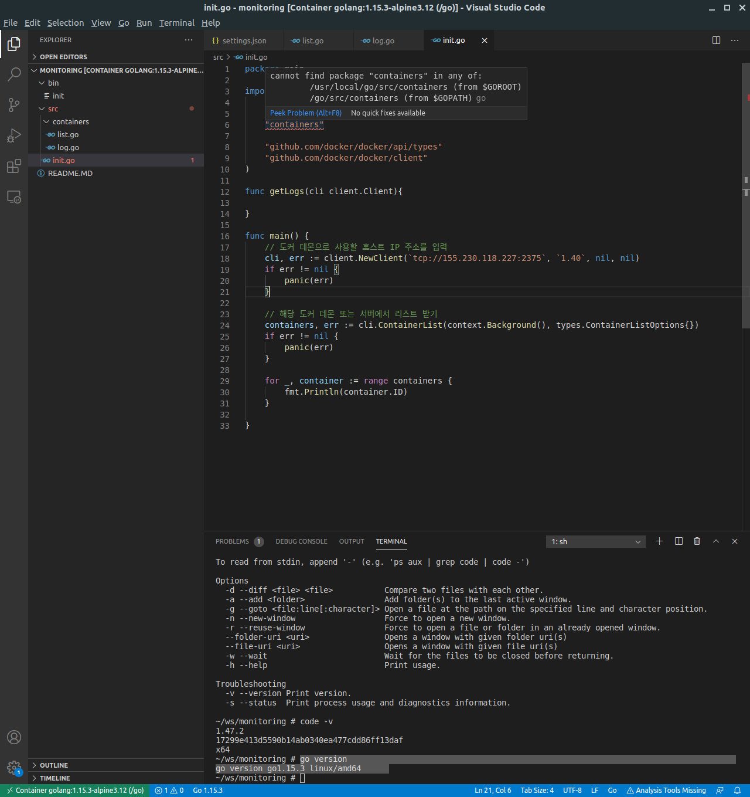

# Problems when using vscode

### Gopath 

#### Environments

- **Docker** `alpine:latest` 이미지 컨테이너 이용
- `vscode` 이용
- `go` 이용

```sh
$ uname -a
Linux a217493bb576 5.4.0-52-generic #57~18.04.1-Ubuntu SMP Thu Oct 15 14:04:49 UTC 2020 x86_64 Linux

$ code -v
1.47.2
17299e413d5590b14ab0340ea477cdd86ff13daf
x64

$ go version
go version go1.15.3 linux/amd64
```

#### Problem and Solution

- `go env` 명령어로 확인되고 `export` 명령어로 설정한 `GOPATH` 값과 **vscode**에서의 `GOPATH` 값이 다름

  

- **vscode** [Files]-[Preferences]-[Settings]-[Go:Infer Gopath] 체크[[1]](https://github.com/golang/vscode-go/blob/master/docs/gopath.md/#%20Automatically%20inferring%20your%20%60GOPATH%60)


