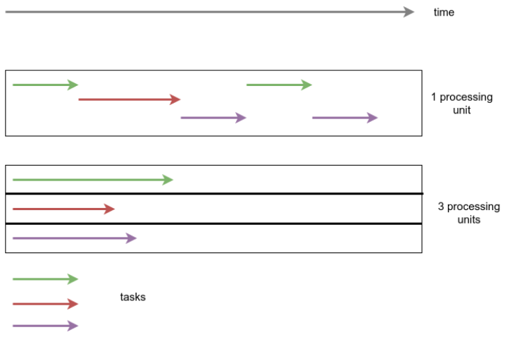

# Concurrency, Parallelism, Asynchronism, Non-Blocking

## Definition

### **Concurrency**

> when two tasks can start, run, and complete ***in overlapping time periods***
>
> e.g. multi-tasking

### **Parallelism**

> when tasks literally run ***at the same time***
>
> e.g. multi-core processing

> Short example:
> ***Concurrency*** is two lines of customers ordering from a single cashier (lines take turns ordering); ***Parallelism*** is two lines of customers ordering from two cashiers (each line gets its own cashier).

> Long example:
>
> - **Concurrency**: Interruptability
> - **Parallelism**: Independentability
>
> Let’s say you have to get done 2 very important tasks in one day:
>
> 1. Get a passport
> 2. Get a presentation done
>
> ## Case 1: Sequential Execution
>
> Ordinarily, you will drive to passport office for 2 hours, wait in the line for 4 hours, get the task done, drive back two hours, go home, stay awake 5 more hours and get presentation done.
>
> ## Case 2: Concurrent Execution
>
> But you’re smart. You plan ahead. You carry a laptop with you, and while waiting in the line, you start working on your presentation. This way, once you get back at home, you just need to work 1 extra hour instead of 5.
>
> In this case, both tasks are done by you, just in pieces. You interrupted the passport task while waiting in the line and worked on presentation. When your number was called, you interrupted presentation task and switched to passport task. The saving in time was essentially possible due to interruptability of both the tasks.
>
> Concurrency, IMO, can be understood as the "isolation" property in [ACID](https://stackoverflow.com/q/3740280/3635931). Two database transactions are considered isolated if sub-transactions can be performed in each and any interleaved way and the final result is same as if the two tasks were done sequentially. Remember, that for both the passport and presentation tasks, *you are the sole executioner*.
>
> ## Case 3: Parallel Execution
>
> Now, since you are such a smart fella, you’re obviously a higher-up, and you have got an assistant. So, before you leave to start the passport task, you call him and tell him to prepare first draft of the presentation. You spend your entire day and finish passport task, come back and see your mails, and you find the presentation draft. He has done a pretty solid job and with some edits in 2 more hours, you finalize it.
>
> Now since, your assistant is just as smart as you, he was able to work on it *independently*, without needing to constantly ask you for clarifications. Thus, due to the independentability of the tasks, they were performed at the same time by *two different executioners*.
>
> *Still with me? Alright...*
>
> ## Case 4: Concurrent But Not Parallel
>
> Remember your passport task, where you have to wait in the line? Since it is **your** passport, your assistant cannot wait in line for you. Thus, the passport task has *interruptability* (you can stop it while waiting in the line, and resume it later when your number is called), but no *independentability* (your assistant cannot wait in your stead).
>
> ## Case 5: Parallel But Not Concurrent
>
> Suppose the government office has a security check to enter the premises. Here, you must remove all electronic devices and submit them to the officers, and they only return your devices after you complete your task.
>
> In this case, the passport task is neither *independentable* nor *interruptible*. Even if you are waiting in the line, you cannot work on something else because you do not have necessary equipment.
>
> Similarly, say the presentation is so highly mathematical in nature that you require 100% concentration for at least 5 hours. You cannot do it while waiting in line for passport task, even if you have your laptop with you.
>
> In this case, the presentation task is *independentable* (either you or your assistant can put in 5 hours of focused effort), but not *interruptible*.
>
> ## Case 6: Concurrent and Parallel Execution
>
> Now, say that in addition to assigning your assistant to the presentation, you also carry a laptop with you to passport task. While waiting in the line, you see that your assistant has created the first 10 slides in a shared deck. You send comments on his work with some corrections. Later, when you arrive back home, instead of 2 hours to finalize the draft, you just need 15 minutes.
>
> This was possible because presentation task has *independentability* (either one of you can do it) and *interruptability* (you can stop it and resume it later). So you concurrently executed *both* tasks, and executed the presentation task in parallel.
>
> Let’s say that, in addition to being overly bureaucratic, the government office is corrupt. Thus, you can show your identification, enter it, start waiting in line for your number to be called, bribe a guard and someone else to hold your position in the line, sneak out, come back before your number is called, and resume waiting yourself.
>
> In this case, you can perform both the passport and presentation tasks concurrently and in parallel. You can sneak out, and your position is held by your assistant. Both of you can then work on the presentation, etc.

[[1] What is the difference between concurrency and parallelism?][1]

Parallelism보다 Concurrency가 더 넓은 의미로 쓰임

## References

[1]: https://stackoverflow.com/questions/1050222/what-is-the-difference-between-concurrency-and-parallelism#comment9338864_1050257