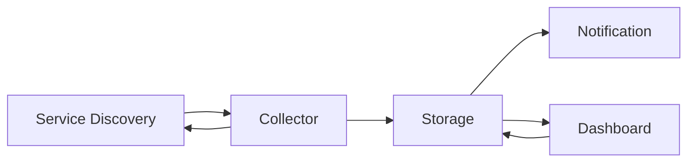

# Container Monitoring System

### Architecture



### Development Sequence

1. image pull
2. conatiner 실행
3. 모든 conatiner들 확인
4. conatiner 정보들 get하기

```mermaid
sequenceDiagram
participant 
```


### Docker Daemon과 Remote Client 연결

1. 호스트의 Docker Daemon에서 Remote client와 [**Remote Connection**](problem/connection.md)을 지원하도록 설정 변경이 필요해
2. 단일 호스트 컨테이너 관련 연산

   - [x] 컨테이너 리스트 받기

   - [ ] 컨테이너 로그 받기

     ```go
     Container
     ```
   
     
   
   - [ ] 컨테이너 메트릭 받기
3. 받은 정보들 데이터베이스 저장
4. 받은 정보들 대쉬보드에 표현해주기

