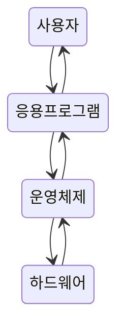

# Overview

### Index

1. [운영체제가 할 일](#1. 운영체제가-할-일)
2. [컴퓨터 시스템의 구성](#2. 컴퓨터 시스템의 구성)
3. 컴퓨터 시스템 구조
4. 운영체제의 작동
5. 자원 관리
6. 보안과 보호
7. 가상화
8. 분산 시스템
9. 커널 자료구조
10. 계산 환경
11. 무료 및 공개 소스 운영체제

## 1. 운영체제가 할 일

컴퓨터 시스템은 네 가지 구성요소로 구분:

- 하드웨어(CPU, 메모리, I/O 등)
- 운영체제
- 응용프로그램(컴파일러, 웹 브라우저 등)
- 사용자

운영체제를 사용자와 시스템 두 관점에서 보면:

- 사용자 관점(User View)

  - 사용자의 관점은 사용되는 인터페이스에 따라 달라짐
  - 한 사용자가 자원을 독점하도록 설계되었으며, 목표는 사용자가 수행하는 작업을 최대화하는 것
  - 이러한 경우 운영체제는 대부분 사용의 용이성을 위해 설계되고 성능에 약간 신경을 쓰고 다양한 하드웨어와 소프트웨어 자원이 어떻게 공유되느냐의 자원의 이용에는 전혀 신경 쓰지 않음

- 시스템 관점(System View)

  > **시스템 관점**
  > 운영체제를 논할 때 시스템 관점이라는 것은 ***컴퓨터를 구성하는 하드웨어의 집합***  의미

  - 컴퓨터의 관점에서 운영체제는 하드웨어와 가장 밀접하게 연관된 프로그램
  - 운영체제를 **자원 할당자(Resource Allocator)**로 볼 수 있음
  - 문제를 해결하기 위해 요구되는 컴퓨터 장치들, 즉 CPU 시간, 메모리 공간, 저장장치 공간, 입출력 장치를 가짐

#### **운영체제의 정의**

- 운영체제의 용도는 시대가 변화하면서 달라졌기 때문에, 보편적인 정의가 없음
- 일반적으로 운영체제는 컴퓨터에서 항상 실행되는 프로그램(**커널**)과 **시스템 프로그램**, 응용프로그램 + 미들웨어

## 2. 컴퓨터 시스템의 구성

- 컴퓨터 시스템은 하나 이상의 CPU와 구성요소와 공유 메모리 사이의 액세스를 제공하는 **공통 버스**를 통해 연결된 여러 장치 컨트롤러로 구성

- 운영체제에는 각 ***장치 컨트롤러***마다 ***장치 드라이버***가 존재

  > **장치 컨트롤러**
  >
  > - 특정 유형의 장치(디스크 드라이브, 오디오 장치, 그래픽 디스플레이, 키보드, 마우스 등)
  >
  > **장치 드라이버(Device Driver)**
  >
  > - 장치 컨트롤러의 작동을 잘 알고 있고 나머지 운영체제 장치에 대한 일관된 인터페이스 제공
  > - CPU와 장치 컨트롤러는 병렬로 실행되어 메모리 사이클을 놓고 경쟁

- 공유 메모리를 질서 있게 액세스하기 위해 **메모리 컨트롤러**는 메모리에 대한 액세스를 **동기화**

- 시스템의 세 가지 주요 측점:

  - Interrupt
  - Storage Structure
  - I/O Structure

#### Interrupt

> 예: 일반적인 컴퓨터 작업(입출력을 수행하는 프로그램)을 고려
>
> 1. 장치 드라이버는 장치 컨트롤러의 적절한 레지스터에 값(어떤 작업인지)을 적재
>
> 2. 장치 컨트롤러는 이러한 레지스터 내용을 검사하여 수행한 작업을 결정
>
>    > 예: 키보드에서 문자 읽기
>
> 3. 컨트롤러는 장치에서 로컬 버퍼로 데이터 전송을 시작
>
> 4. 전송이 완료되면 장치 컨트롤러는 장치 드라이버에게 작업 완료를 알림
>
> 5. 장치 드라이버는 읽기 요청이면 데이터 또는 데이터에 대한 포인터를 반환하며 운영체제의 다른 부분에 제어를 넘김

- 그럼, 컨트롤러는 장치 드라이버에게 작업을 완료했다는 사실을 어떻게 알리는가? ***Interrupt***