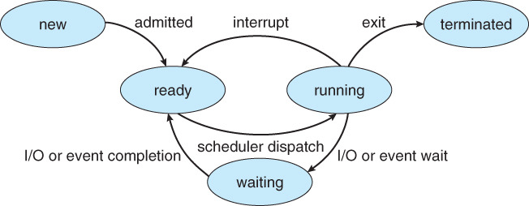

# Process

### History

-  초기 컴퓨터 시스템에서는 한 번에 하나의 프로그램 실행만을 허용(배치 프로세싱; Batch processing)

  > 프로그램은 시스템을 완전히 제어하거나 모든 자원에 대해 접근할 수 있었음
  >
  > 이때 하나의 프로그램을 작업(job)이라 부름

-  현대 컴퓨터 시스템은 메모리에 다수의 프로그램이 적재되어 병행 실행

  > 그에 따라 다양한 프로그램을 보다 견고하게 제어하고 구획화하는 것이 필요함
  >
  > 메모리에 다수의 프로그램 적재(Multi-Programming)
  >
  > 매우 짧은 시간 간격마다 프로세스들을 번갈아가면서 실행(Multi-Tasking)
  >
  > 다수의 프로그램이 병행 실행, 즉 다수의 프로그램이 시간의 차이 없이 동시에 실행(Multi-Processing)

-  이러한 필요성이 프로세스의 개념을 탄생시키는 계기가 됨

  > 따라서 **프로세스란 실행 중인 프로그램**이라 정의함


그럼, 프로세스가 어떤 것인지, 운영체제에서 어떻게 표현되는지, 어떻게 작동하는지에 대해 구체적으로 살펴보자

### Objective

- 프로세스의 개별 구성요소 식별 및 운영체제에서의 표현 및 스케줄링
- 운영체제에서 프로세스 생성 및 종료
- IPC: 공유 메모리 및 메세지 패싱
- PIPE와 POSIX 공유메모리를 사용하여 프로세스 간 통신 수행하는 프로그램 설계
- Socket, RPC를 사용한 클라이언트-서버 통신
- Linux 운영체제와 상호 작용하는 커널 모듈 설계


## Concept

### Process

- 비공식적으로, 프로세스란 실행 중인 프로그램

  > 프로그램 그 자체가 프로세스가 아닌 이유
  >
  >  만약 동일 프로그램을 여러 번 실행시키면 이에 따라 여러 개의 프로세스가 생성되는데, 각 프로세스는 텍스트 섹션은 동일하겠지만, 나머지 데이터, 힙, 스택 영역은 다르다. 이에 따라 프로그램은 수동적 개체(Passive entity), 프로세스는 능동적 개체(Active entity)라고도 한다.

- 프로세스의 현재 활동 상태는 프로그램 카운터 값과 프로세서 레지스터 내용으로 나타냄

- 프로세스의 메모리 배치는 일반적으로 여러 섹션으로 구분됨
  

- Text Section
  실행 코드

- Data Section
  전역 변수들이 저장되는데, 또한 초기화 여부에 따라 서로 다른 하위 섹션으로 나뉨

  - Data Section
    초기화된 전역 변수
  - BSS(Block Started by Symbol) Section
    초기화되지 않은 전역 변수

- Heap Section
  프로그램 실행 중 동적으로 할당되는 메모리

- Stack Section
  함수가 호출될 때마다 이에 상응하는 함수 매개변수, 지역 변수 및 복귀 주소 등을 포함하는 활성화 레코드(Activation Record)가 스택에 푸쉬됨

- 스택과 힙은 동적으로 할당되는데, 서로의 방향으로 커지더라도 운영체제는 서로 겹치지 않도록 해야 함
  1. 프로세스 종료
  2. 추가 메모리 할당(링크드 리스트 등 특정 자료구조 이용)

- 프로세스 자체가 다른 개체를 위한 실행 환경으로 동작할 수 있음

  > ```sh
  > $ java program
  > ```
  >
  > java 명령어는 JVM이라는 프로세스를 실행시키고, JVM이라는 가상 기계 안에서 program을 실행시킴

  

### Process State

- 프로세스는 실행되면서 그 상태가 변하는데, 프로세스 상태는 부분적으로 그 프로세스의 현재 활동에 따라 정의됨
  

- 상태에 대한 이름은 운영체제에 따라 다를 수 있지만, 이들이 나타내는 상태는 모든 시스템에서 찾아볼 수 있음

- 프로세스 상태는 어떤 운영체제는 더 상세할 수도 있음

- **가장 중요한 것은 어느 한순간에 한 프로세서 코어에서는 오직 하나의 프로세스만 실행된다는 것**

  > 내가 헷갈렸던 부분
  >
  > 하나의 프로세서 코어에서 절반씩 나눠서 두 개의 프로그램을 실행시킬 수 있는가?
  >
  > **왜 안될까?**
  >
  > CPU 구조를 보면 레지스터와 연산 처리부분으로 크게 나뉘는데, 이를 지원하기 위해서는
  >
  > 1. 레지스터가 일반적인 것보다 두 배 더 커야 함
  > 2. 그렇지 않다면, 레지스터를 매번 번갈아가면서 실행시켜야 된다는 말인데 이는 극심한 비효율을 야기

### Process Control Block

- 각 프로세스는 운영체제에서 프로세스 제어 블록(Process Control Block, PCB)로 표현됨

  

- 프로그램 카운터
  이 프로세스가 다음에 실행할 명령어 주소를 가리킴

- CPU 레지스터들
   CPU 레지스터는 컴퓨터 구조에 따라 다양한 수와 유형을 가지는데, 프로세스가 다시 스케줄 될 때 계속 올바르게 실행되려면 인터럽트 발생 시 저장되어야 함

- CPU 스케줄링 정보
  프로세스 우선순위, 스케줄 큐에 대한 포인터, 다른 스케줄 매개변수 등을 포함([이후 자세한 설명](process_scheduling.md))

- 메모리 관리 정보
  운영체제에 의해 사용되는 메모리 시스템에 따라 base 레지스터와 limit 레지스터 값, 페이지 테이블, 세그먼트 테이블 등과 같은 정보를 포함([이후 자세한 설명](memory.md))

- 회계 정보
  CPU 사용시간, 경과된 실시간, 시간 제한, 계정 번호, 잡 또는 프로세스 번호 등을 포함

- 입출력 상태 정보
  이 프로세스에 할당된 입출력 장치들 및 열린 파일의 목록 등을 포함

### Thread

- [이후 자세한 설명](thread.md)

## Scheduling

### Scheduling Queue

### CPU Scheduling

### Context Switch

## Operation on Processes

### Creation

### Termination

## Inter-porcess Communication

### IPC in Shared-Memory Systems


### IPC in Message-Passing Systems

#### Naming

#### Synchronization

#### Buffering

### Examples

#### POSIX Shared Memory

#### Mach Message Passing

#### Windows

#### Pipes

#### Named Pipes

## Communication in Client-Server Systems

### Socket

### Remote Process Calls,

