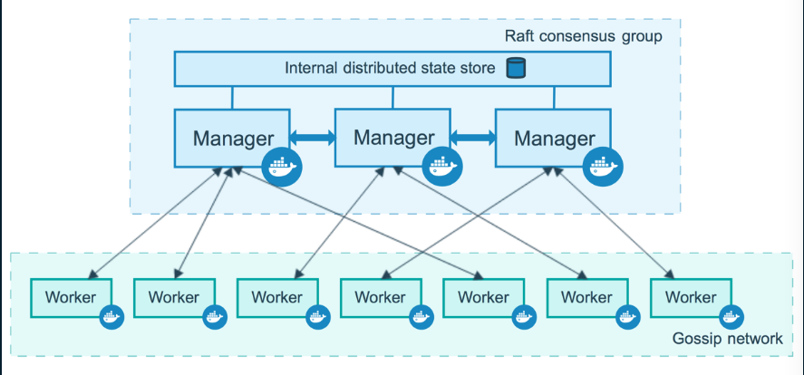
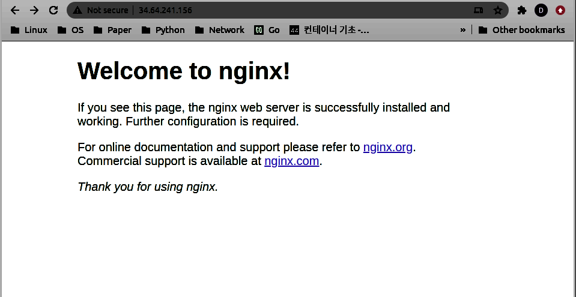
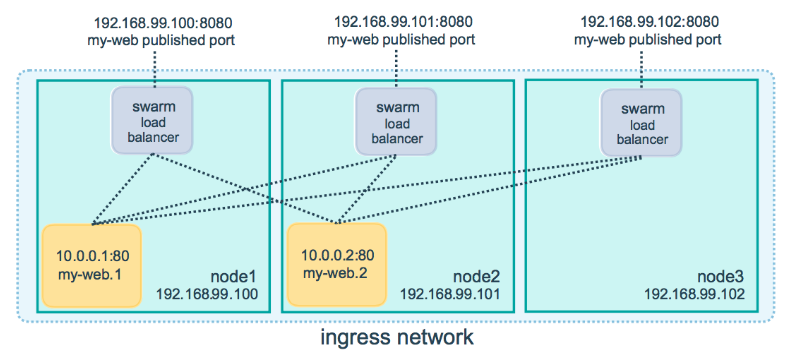
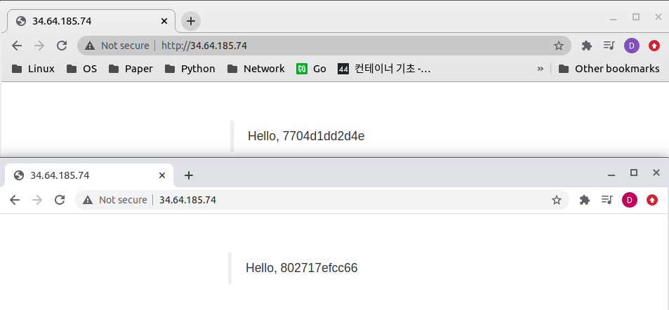

# Docker Swarm

### Concept

- CPU, 메모리, 저장장치 등 리소스가 부족하면 이를 해결하기 가장 좋은 방법은 Scale Out

  > Scale Out(수평적 확장)
  >
  >  값비싼 고성능의 컴퓨터를 구입해 성능 업그레이드를 하기 보다는, 저렴하고 상대적으로 저성능 컴퓨터 여러대를 연결하여 성능을 업그레이드하는 것

- Docker Swarm은 Scale Out을 했을 때 노드(컴퓨터)들을 관리하기 위한 툴

  > 서버 여러대를 하나의 리소스 풀(Pool)로 만들어 사용할 수 있음

- 노드들을 관리하기 하기 위해서는 아래와 같은 기능들이 필요([더 자세히](https://docs.docker.com/engine/swarm))

  - Service Decovery
    새로운 서버나 컨테이너가 추가됐을 때, 이를 발견하는 기능

  - Scheduler, Load Balancer
    어떤 서버에 컨테이너를 할당할 것인가?

  - High Availability Assurance

    어떤 클러스터 서버가 다운이 됐을 때, 이에 대해 어떻게 보장할 것인가?

  - 이 외에 더 많은 기능들이 있을 수 있음

- Docker Swarm에는 두 가지 종류가 있음

  - Swarm Classic
  - [Swarm Mode](#Swarm Mode)

### Swarm Classic vs Swarm Mode

| Feature   | Swarm Classic                                                | Swarm Mode                                                   |
| --------- | ------------------------------------------------------------ | ------------------------------------------------------------ |
| Concept   | 여러 대의 도커 서버를 하나의 지점에서 사용하도록 단일 접근점을 제공 | MSA 아키텍처의 컨테이너를 다루기 위한 클러스링 기능에 초점   |
| Execution | `docker run`, `docker ps` 등과 같이 일반적인 도커 명령어와 도커 API로 클러스터 서버를 제어·관리 | `docker run`, `docker ps` 등과 같이 일반적인 도커 명령어와 도커 API로 클러스터 서버를 제어·관리 |
| Tool      | 분산 코디네이터, 에이전트와 같은 클러스터 툴이 별도로 구동됨 | 같은 컨테이너를 동시에 여러 개 생성해 필요에 따라 유동적으로 컨테이너 수를 조절할 수 있음. 컨테이너로의 연결을 분산하는 로드밸런싱 기능을 자체적으로 지원(분산 코디네이터) |

- 분산 코디네이터는 클러스터에 영입할 새로운 서버 발견, 클러스터의 각종 설정 저장, 데이터 동기화 등에 주로 이용됨
- 대표적으로 etcd, zookeeper, consul 등이 있으나, Swarm mode에서는 이를 자체 지원하기 때문에 별도 구축할 필요가 없음
- 스웜 모드가 서비스 확장성과 안정성 등 여러 측면에서 클래식보다는 뛰어나서 주로 이용

## Swarm Mode

- 스웜 모드는 별도의 설치 과정이 필요 없으며, 도커 엔진 자체에 내장되어 있음

- `docker info` 명령어를 통해 도커 엔진의 스웜 모드 클러스터 정보를 확인할 수 있음

  ```bash
  worker1:~$ sudo docker info
  Client:
   Debug Mode: false
  
  Server:
   ...
   # 별도로 swarm을 사용하지 않았다면 inactive
   Swarm: inactive
   ...
  ```
  
- 서버 클러스터링을 할 때는 반드시 각 서버의 시각을 NTP 등의 툴을 이용해 동기화해야 함

  > 서버 간 설정된 시각이 다를 경우 예상치 못한 오류가 발생할 수 있음

### 도커 스웜 모드의 구조

- 클러스터 컴퓨터에서 각 컴퓨터 시스템은 노드라고 일컫음

- 도커 스웜 모드에서는 두 가지 종류의 노드로 구성

  - 매니저 노드
    워커 노드를 관리하기 위한 도커 서버인데, 매니저 노드는 리더 노드와 매니저 노드로 나뉨

    > **리더 노드**
    >
    > 모든 매니저 노드에 대한 데이터 동기화와 관리를 담당하므로 항상 작동할 수 있는 상태여야 함
    > 리더 매니저 노드가 다운이 되면 매니저는 새로운 리더를 선출하는데 이 때 **[Raft Consensus 알고리즘](raft_consensus_algorithm.md)**을 사용
    >
    > [**Raft Consensus 알고리즘**](https://raft.github.io/)
    > 리더 선출 및 고가용성 보장을 위한 알고리즘

  - 워커 노드
    실제로 컨테이너가 생성되고 관리되는 도커 서버

  

- 매니저 노드는 가능한 한 홀수 개로 구성하는 것이 바람직

  >  스웜 모드는 매니저 노드의 절반 이상에 장애가 생겨 정상적으로 작동하지 못할 경우 장애가 생긴 매니저 노드가 복구 될 때까지 클러스터의 운영을 중단한다. 따라서 홀수 개로 구성하면 장애를 더 허용할 수 있ᅌᅳ며, 매니저 노드 사이의 데이터 일관성을 유지할 수 있다.

- 매니저 노드 포트 사용(각 용도를 정확하게 알아봐야 함)

  | Purposd                          | Port               |
  | -------------------------------- | ------------------ |
  | cluster management communcations | 2377               |
  | commumication among nodes        | 7946/tcp, 7946/udp |
  | overlay network traffic          | 4789/tcp, 4789/udp |

  

### 스웜 모드 클러스터 구축

- #### 스웜 초기화

```bash
# 만약 호스트에 두 개 이상의 NIC가 존재하는 경우 하나의 IP 주소를 정해줘야 함
# 그렇지 않다면, docker swarm init만 입력하면 됨
# 생성된 토큰이 외부에 노출되면, 익명의 다른 사람들도 swarm에 등록할 수 있어 보안에 위협을 줄 수 있으니 노출하지 않는게 좋음
# 또한 주기적으로 토큰을 변경시켜주는 것이 좋음
manager:$ docker swarm init [--advertise-addr [ipaddr]]
Swarm initialized: current node (ya63idbsjpme06pq3inegbbxc) is now a manager.

To add a worker to this swarm, run the following command:

    docker swarm join --token SWMTKN-1-364zczpia8i8qjzg1jbvg7737cf18l76hnjz5sligqm7moy3zx-9roh0r3lh08tf8wbtl0myyapn [ip addr: port number(default: 2377)]

To add a manager to this swarm, run 'docker swarm join-token manager' and follow the instructions.

# docker info 명령어를 통해 docker swarm이 활성화되고 이에 대한 info를 확인할 수 있ᅌᅳᆷ
manager:$ docker info
Client:
 Debug Mode: false

Server:
 ...
 Swarm: active
  NodeID: hrsfgkiulb8r1hlhtczg3r0al
  Is Manager: true
  ClusterID: n5n6aemyqnpkq90bix4l7a2qq
  Managers: 1
  Nodes: 1
  Default Address Pool: 10.0.0.0/8  
  SubnetSize: 24
  Data Path Port: 4789
  Orchestration:
   Task History Retention Limit: 5
  Raft:
   Snapshot Interval: 10000
   Number of Old Snapshots to Retain: 0
   Heartbeat Tick: 1
   Election Tick: 10
  Dispatcher:
   Heartbeat Period: 5 seconds
  CA Configuration:
   Expiry Duration: 3 months
   Force Rotate: 0
  Autolock Managers: false
  Root Rotation In Progress: false
  Node Address: [ip addr]
  Manager Addresses:
   [ip addr]
 ...
```

- #### 다른 노드에서 Swarm join

```bash
# Worker node 1
worker1:~$ sudo docker swarm join --token SWMTKN-1-0z0g0kwbm8qlfcl11nav1e6fszlud6mi9tuci9p098hkow6ucb-27xl3nexr5epzwsrk8iyniu6l 155.230.118.227:2377

# Worker node 2
worker2:~$ sudo docker swarm join --token SWMTKN-1-0z0g0kwbm8qlfcl11nav1e6fszlud6mi9tuci9p098hkow6ucb-27xl3nexr5epzwsrk8iyniu6l 155.230.118.227:2377

# Worker node 3
worker3:~$ sudo docker swarm join --token SWMTKN-1-0z0g0kwbm8qlfcl11nav1e6fszlud6mi9tuci9p098hkow6ucb-27xl3nexr5epzwsrk8iyniu6l 155.230.118.227:2377
```

- #### Swarm node 확인

```bash
# check the nodes were registered on mangaer
manager:~$ docker node ls
ID                            HOSTNAME            STATUS              AVAILABILITY        MANAGER STATUS      ENGINE VERSION
47xxqko90bhy31lags04rm9qt *   manager             Ready               Active              Leader              19.03.12
nwsuj016tn1ontxf8k2duojtu     worker1     		  Ready               Active                                  19.03.11
888ujsqs03n0qcbv3akiiqv07     worker2  		      Ready               Active                                  19.03.11
xpjdpcnbuih0brtchimsno740     worker3  		      Ready               Active                                  19.03.11
```

- #### Swarm leave

  ```bash
  # worker3에서 swarm을 떠남
  # 만약 노드가 매니저라면 --force 옵션 필요
  worker4:~$ sudo docker swarm leave
  Node left the swarm.
  
  # manager에서 노드들을 체크해보니, 아직 worker 3가 남아있음
  manager:~$ docker node ls
  ID                            HOSTNAME            STATUS              AVAILABILITY        MANAGER STATUS      ENGINE VERSION
  47xxqko90bhy31lags04rm9qt *   manager             Ready               Active              Leader              19.03.12
  nwsuj016tn1ontxf8k2duojtu     worker1     		  Ready               Active                                  19.03.11
  888ujsqs03n0qcbv3akiiqv07     worker2  		      Ready               Active                                  19.03.11
  xpjdpcnbuih0brtchimsno740     worker3  		      Ready               Active                                  19.03.11
  
  # manager에서 worker3 노드를 삭제해야 함
  manager:~$ docker node rm xpj
  xpj
  manager:~$ docker node ls
  ID                            HOSTNAME            STATUS              AVAILABILITY        MANAGER STATUS      ENGINE VERSION
  47xxqko90bhy31lags04rm9qt *   manager             Ready               Active              Leader              19.03.12
  nwsuj016tn1ontxf8k2duojtu     worker1     		  Ready               Active                                  19.03.11
  888ujsqs03n0qcbv3akiiqv07     worker2  		      Ready               Active                                  19.03.11
  ```

  > 너무 귀찮지 않나?
  >
  > 그럼 다른 매니져에서도 매번 그렇게 지워줘야 하는가?

- #### Swarm Promote/Demote

  - 워커 노드를 매니저 노드로 변경하거나, 매니저 노드를 워커 노드로 변경시키는 명령어
  - 매니저 노드가 한 개 밖에 없으면 워커 노드로 변경할 수 없음
  - 매니저 노드들 중 리더 노드를 워커 노드로 변경했으면, 남은 매니저 노드 중에서 새로운 리더를 선출

#### Error

- [x] 어떤 노드를 swarm에 매니저로 join 할때 에러 발생

```bash
dohan@node1:~$ sudo docker swarm join --token SWMTKN-1-4u741lvgmo980ed6ber8a8yxbipwqtvqm9c05g90jjwkyll0oc-6fwx847fnv3nltrhk0y4jgh17 155.230.118.227:2377
This node joined a swarm as a worker.

dohan@node1:~$ sudo docker swarm join --token SWMTKN-1-4u741lvgmo980ed6ber8a8yxbipwqtvqm9c05g90jjwkyll0oc-0wn2ya9c3so1ia8ogrjmsste7 155.230.118.227:2377
Error response from daemon: manager stopped: can't initialize raft node: rpc error: code = Unknown desc = could not connect to prospective new cluster member using its advertised address: rpc error: code = DeadlineExceeded desc = context deadline exceeded
```

- [x] 어떤 노드를 promote/demote할 경우 변화가 없음

```bash
dohan@dohan:~$ docker node ls
ID                            HOSTNAME            STATUS              AVAILABILITY        MANAGER STATUS      ENGINE VERSION
wz18nmgm34xe850b8pprxd93t *   dohan               Ready               Active              Leader              19.03.12
4psduw0k49ktbnhf66ntz9g1r     node1               Ready               Active                                  19.03.11
wytc6b3s7jtjxpb0p61u9f3xq     node2               Ready               Active                                  19.03.11
2ifzdp7etr0kx74plse50witz     node3               Ready               Active                                  19.03.11
dohan@dohan:~$ docker node promote wy
Node wy promoted to a manager in the swarm.
dohan@dohan:~$ docker node ls
ID                            HOSTNAME            STATUS              AVAILABILITY        MANAGER STATUS      ENGINE VERSION
wz18nmgm34xe850b8pprxd93t *   dohan               Ready               Active              Leader              19.03.12
4psduw0k49ktbnhf66ntz9g1r     node1               Down                Active                                  19.03.11
wytc6b3s7jtjxpb0p61u9f3xq     node2               Ready               Active                                  19.03.11
2ifzdp7etr0kx74plse50witz     node3               Ready               Active                                  19.03.11
```

##### Solutions:

- 원인
  매니저 관련 operation은 2377 포트를 통해서 상호작용을 하는데 node1, node2, node3의 포트를 미개방된 상태
- 해결
  포트 개방 이후 문제 해결됨

### Swarm Mode Service

#### Concept

- 기존 도커 명령어의 제어 단위는 컨테이너지만, swarm에서는 **서비스(Service)**

- 서비스는 같은 이미지에서 생성된 컨테이너의 집합이며, 서비스를 제어하면 해당 서비스 내의 컨테이너(Task)에 같은 명령이 수행됨

- 스웜 스케줄러는 서비스의 정의에 따라 컨테이너를 할당할 적합한 노드를 선정하고, 해당 노드에 컨테이너를 분산해서 할당함

- 도커 스웜에서 서비스는 두 가지 모드가 존재

  |               |                       Replicated Mode                        |                         Global Mode                          |
  | :-----------: | :----------------------------------------------------------: | :----------------------------------------------------------: |
  |     특징      | 서비스 컨테이너들에 대한 상태를 계속 확인하고 있다가 서비스 내에 정의된 레플리카의 수만큼 컨테이너가 스웜 클러스터에 존재하지 않으면 새로운 컨테이너 레플리카를 생성 | 스웜 클러스터 내에서 사용할 수 있는 모든 노드에 컨테이너를 반드시 하나씩 생성하며, 따로 레플리카 셋의 수를 지정하지 않음 |
  | 사용하는 경우 |      실제 서비스를 제공하기 위해 일반적으로 쓰이는 모드      | 스웜 클러스터를 모니터링하기 위한 에이전트 컨테이너 등을 생성해야 할 때 |
  |    사용법     | {docker service create, docker service create --mode replicated |             docker service create --mode global              |

- Rolling Update

  > 여러 개의 서버, 컨테이너 등으로 구성된 클러스터의 설정이나 데이터 등을 변경하기 위해 컨테이너를 하나씩 재시작하는 것을 의미
  >
  > 만약 한번에 모든 컨테이너를 종료하면, 그 시간만큼 서비스를 하지 못하기 때문에 순차적으로 하나씩 재시작함

- 스웜 모드는 라우든 로빈 방식으로 서비스 내에 접근할 컨테이너를 결정

  > 만약 각 노드의 트래픽이나 자원 사용량 등을 고려해 로드 밸런싱을 해야한다면 적합하지 않음

### 서비스 다루기

- 서비스를 제어하는 도커 명령어는 전부 매니저 노드에서만 사용할 수 있음
- 서비스를 사용하기 위한 명렁어는 `docker service`로 시작

#### 서비스 생성

- 명령어는 `docker service create [OPTIONS] IMAGE [COMMAND] [ARG...]`

  ``` bash
  # ubuntu:18.04 컨테이너 /bin/sh 를 통해 "while ..." 명령문을 실행시킴
  manager:~$ docker service create --replicas 4 ubuntu:18.04 /bin/sh -c "while true; do echo hello; sleep 1; done"
  lgjml3kw9zsqak65cni3zhtl5
  overall progress: 4 out of 4 tasks 
  1/4: running   [==================================================>] 
  2/4: running   [==================================================>] 
  3/4: running   [==================================================>] 
  4/4: running   [==================================================>] 
  verify: Service converged
  ```

#### 서비스 목록 확인

- 명령어는 `docker service ls`

  ```bash
  manager:~$  docker service ls
  ID                  NAME                MODE                REPLICAS            IMAGE               PORTS
  lgjml3kw9zsq        strange_volhard     replicated          4/4                 ubuntu:18.04        
  ```

#### 서비스 자세한 정보

- 명령어는 docker service ps [SERVICE...]

  ```bash
  manager:~$ docker service ps lg
  ID                  NAME                    IMAGE               NODE        DESIRED STATE       CURRENT STATE             ERROR               PORTS
  nymtt93gnrgq        strange_volhard.1       ubuntu:18.04        worker1     Running             Running 37 seconds ago                        
  ovvn7a9cwy3o         \_ strange_volhard.1   ubuntu:18.04        worker2     Shutdown            Shutdown 24 seconds ago                       
  ak5fz6k2s8r0         \_ strange_volhard.1   ubuntu:18.04        worker3     Shutdown            Shutdown 29 seconds ago                       
  ua3ajxghqld3        strange_volhard.2       ubuntu:18.04        manager     Running             Running 47 seconds ago                        
  lvsscsqz3exv        strange_volhard.3       ubuntu:18.04        manager     Running             Running 38 seconds ago                        
  sl64l5rpjegm         \_ strange_volhard.3   ubuntu:18.04        worker2     Shutdown            Shutdown 24 seconds ago                       
  6aysx6ocah76        strange_volhard.4       ubuntu:18.04        worker1     Running             Running 47 seconds ago 
  ```

#### 서비스 삭제

- 명령어는 docker service rm [SERVICE...]

  ```bash
  manager:~$ docker service rm lg
  lg
  ```

#### Nginx 예제

- 생성 및 실행 확인

  ```bash
  manager:~$ docker service create --replicas 4 --name myweb -p 80:80 nginx
  ull32a02u8k9xsln2bplc7rce
  overall progress: 4 out of 4 tasks 
  1/4: running   [==================================================>] 
  2/4: running   [==================================================>] 
  3/4: running   [==================================================>] 
  4/4: running   [==================================================>] 
  verify: Service converged 
  
  manager:~$ docker service ls
  ID                  NAME                MODE                REPLICAS            IMAGE               PORTS
  ull32a02u8k9        myweb               replicated          4/4                 nginx:latest        *:80->80/tcp
  manager:~$ docker service ps myweb
  ID                  NAME                IMAGE               NODE        DESIRED STATE       CURRENT STATE                ERROR               PORTS
  om97wl77msfm        myweb.1             nginx:latest        worker1     Running             Running about a minute ago         
  4pd0agf4t1xg        myweb.2             nginx:latest        manager     Running             Running 2 minutes ago                            
  svgvnyah0vgh        myweb.3             nginx:latest        worker2     Running             Running 2 minutes ago                            
  si75zshibvah        myweb.4             nginx:latest        worker3     Running             Running 2 minutes ago    
  ```



- 레플리카 수 조정

  ```bash
  manager:~$ docker service scale myweb=10
  myweb scaled to 10
  overall progress: 10 out of 10 tasks 
  1/10: running   [==================================================>] 
  2/10: running   [==================================================>] 
  3/10: running   [==================================================>] 
  4/10: running   [==================================================>] 
  5/10: running   [==================================================>] 
  6/10: running   [==================================================>] 
  7/10: running   [==================================================>] 
  8/10: running   [==================================================>] 
  9/10: running   [==================================================>] 
  10/10: running   [==================================================>] 
  verify: Service converged 
  
  manager:~$ docker service ps myweb 
  ID                  NAME                IMAGE               NODE                DESIRED STATE       CURRENT STATE            ERROR               PORTS
  om97wl77msfm        myweb.1             nginx:latest        worker1     		  Running             Running 9 minutes ago                        
  4pd0agf4t1xg        myweb.2             nginx:latest        manager               Running             Running 9 minutes ago                        
  svgvnyah0vgh        myweb.3             nginx:latest        worker1     		  Running             Running 9 minutes ago                        
  si75zshibvah        myweb.4             nginx:latest        manager               Running             Running 9 minutes ago                        
  sozwwg9k1kcy        myweb.5             nginx:latest        worker1     		  Running             Running 17 seconds ago                       
  iuu3ek0909pj        myweb.6             nginx:latest        manager               Running             Running 16 seconds ago                       
  b8k7vv5nm039        myweb.7             nginx:latest        worker1     		  Running             Running 18 seconds ago                       
  yydem55npoyj        myweb.8             nginx:latest        manager               Running             Running 18 seconds ago                       
  oyhbhceaeo15        myweb.9             nginx:latest        worker1     		  Running             Running 18 seconds ago                       
  up7oze15fc9j        myweb.10            nginx:latest        manager               Running             Running 17 seconds ago 	
  ```

  - 컨테이터가 어떤 한 노드에 여러 개 중복되어 있는데, 하나의 `포트 80`으로는 서비스 하기에 어떤 문제가 발생하지 않을까?

    > 노드 수보다 레플리카가 클 때 주어진 포트로 고정되는 것이 아니라, 자동으로 리다이렉트 되기 때문에 상관 없음
    >
    > ***어떻게 리다이렉트 된 포트 번호를 알 수 있는가?***

### 스웜 모드 서비스 장애 복구

-  레플리카 모드로 설정된 서비스의 컨테이너 정지하거나 특정 노드가 다운되면 스웜 매니저는 새로운 컨테이너를 생성해 자동으로 복구함

  ```bash
  # myweb 관련 컨테이너 목록
  manager:~$ docker ps -a
  CONTAINER ID        IMAGE                        COMMAND                  CREATED             STATUS                     PORTS                    NAMES
  4e6eb27bcdad        nginx:latest                 "/docker-entrypoint.…"   12 minutes ago      Up 12 minutes              80/tcp                   myweb.10.v0yxt3tgj1g1s3enub7to1u3i
  f501edba934c        nginx:latest                 "/docker-entrypoint.…"   12 minutes ago      Up 12 minutes              80/tcp                   myweb.13.s1t5kyu09kyutkqf0q24m2u70
  89c8f32eb5c1        nginx:latest                 "/docker-entrypoint.…"   12 minutes ago      Up 12 minutes              80/tcp                   myweb.17.472tg7eqs6fmhgm5zbur8nkg5
  80e1c913492e        nginx:latest                 "/docker-entrypoint.…"   12 minutes ago      Up 12 minutes              80/tcp                   myweb.12.vci55z47crqnpcuhf1m199gj0
  b56a868ab6ce        nginx:latest                 "/docker-entrypoint.…"   12 minutes ago      Up 12 minutes              80/tcp                   myweb.14.7gsa8erf1ius1xbglva7bb4xx
  a7d0908d30c1        nginx:latest                 "/docker-entrypoint.…"   12 minutes ago      Up 12 minutes              80/tcp                   myweb.16.rkkrw2pklec4ixnze5hc2pimb
  f68c68dd312a        nginx:latest                 "/docker-entrypoint.…"   16 minutes ago      Up 16 minutes              80/tcp                   myweb.8.yyingress overlaydem55npoyjbpehqhglhxyym
  85a348242ccd        nginx:latest                 "/docker-entrypoint.…"   16 minutes ago      Up 16 minutes              80/tcp                   myweb.6.iuu3ek0909pjo2hdkderv5yhv
  e338759289ca        nginx:latest                 "/docker-entrypoint.…"   25 minutes ago      Up 25 minutes              80/tcp                   myweb.4.si75zshibvahjs3vl4f0l4fhj
  4c790a13c6e2        nginx:latest                 "/docker-entrypoint.…"   25 minutes ago      Up 25 minutes              80/tcp                   myweb.2.4pd0agf4t1xgvgg4sxj22z0z0
  
  # 위 목록 중에서 myweb.2.4pd0agf4t1xgvgg4sxj22z0z0를 삭제해보자
  manager:~$ docker rm -f myweb.2.4pd0agf4t1xgvgg4sxj22z0z0 
  myweb.2.4pd0agf4t1xgvgg4sxj22z0z0
  
  # --filter is-task=true를 이용하면 service task만 확인할 수 있음
  # myweb.2.4pd0agf4t1xgvgg4sxj22z0z0은 삭제됐으나, 새로운 컨테이너 myweb.2.kd444f3a7innpymnwt3jmrygu가 생성됨을 확인
  manager:~$ docker ps --filter is-task=true
  CONTAINER ID        IMAGE               COMMAND                  CREATED             STATUS              PORTS               NAMES
  f9814567c261        nginx:latest        "/docker-entrypoint.…"   14 seconds ago      Up 9 seconds        80/tcp              myweb.2.kd444f3a7innpymnwt3jmrygu
  4e6eb27bcdad        nginx:latest        "/docker-entrypoint.…"   12 minutes ago      Up 12 mingress overlayinutes       80/tcp              myweb.10.v0yxt3tgj1g1s3enub7to1u3i
  f501edba934c        nginx:latest        "/docker-entrypoint.…"   12 minutes ago      Up 12 minutes       80/tcp              myweb.13.s1t5kyu09kyutkqf0q24m2u70
  89c8f32eb5c1        nginx:latest        "/docker-entrypoint.…"   12 minutes ago      Up 12 minutes       80/tcp              myweb.17.472tg7eqs6fmhgm5zbur8nkg5
  80e1c913492e        nginx:latest        "/docker-entrypoint.…"   12 minutes ago      Up 12 minutes       80/tcp              myweb.12.vci55z47crqnpcuhf1m199gj0
  b56a868ab6ce        nginx:latest        "/docker-entrypoint.…"   12 minutes ago      Up 12 minutes       80/tcp              myweb.14.7gsa8erf1ius1xbglva7bb4xx
  a7d0908d30c1        nginx:latest        "/docker-entrypoint.…"   12 minutes ago      Up 12 minutes       80/tcp              myweb.16.rkkrw2pklec4ixnze5hc2pimb
  f68c68dd312a        nginx:latest        "/docker-entrypoint.…"   17 minutes ago      Up 17 minutes       80/tcp              myweb.8.yydem55npoyjbpehqhglhxyym
  85a348242ccd        nginx:latest        "/docker-entrypoint.…"   17 minutes ago      Up 17 minutes       80/tcp              myweb.6.iuu3ek0909pjo2hdkderv5yhv
  e338759289ca        nginx:latest        "/docker-entrypoint.…"   26 minutes ago      Up 26 minutes       80/tcp              myweb.4.si75zshibvahjs3vl4f0l4fhj
  ```

### 서비스 롤링 업데이트

- 스웜 모드는 롤링 업데이트를 자체적으로 지원하며, 매우 간단하게 사용할 수 있음

- 명령어는 `docker service update --image IMAGE SERVICE`

- `docker service create` or `docker service update` 명령어를 통해서 롤링 업데이트 주기, 동시에 진행할 레플리카 수, 실패했을 때 대처 등 다양한 설정을 할 수 있음

- 업데이트 완료 후 확인은 `docker service inspect` 또는 `docker inspect --type service` 명령어를 통해 할 수 있음

  ```shell
  root@host:~$ docker service create --name myweb --replicas 5 nginx:1.10
  jexza82of04ti4iock9pf93n7
  overall progress: 5 out of 5 tasks 
  1/10: running   [==================================================>] 
  2/10: running   [==================================================>] 
  3/10: running   [==================================================>] 
  4/10: running   [==================================================>] 
  5/10: running   [==================================================>] 
  verify: Service converged 
  
  # 이전에 nginx:1.10인 것을 nginx:1.11로 업데이트
  # 1번부터 5번 레플리카까지 순차적으로 업데이트 되는 것을 확인할 수 있음
  root@host:~$ docker service update --image nginx:1.11 myweb
  myweb
  overall progress: 5 out of 5 tasks 
  1/10: running   [==================================================>] 
  2/10: running   [==================================================>] 
  3/10: running   [==================================================>] 
  4/10: running   [==================================================>] 
  5/10: running   [==================================================>] 
  verify: Service converged 
  
  # 업데이트 확인
  # "Spec"		 : 업데이트된 현재 설정
  # "PreviousSpec" : 이전 설정
  root@host:~$ docker service inspect myweb
  [
      {
          ...
          "Spec": {
              "Name": "myweb",
              "Labels": {},
              "TaskTemplate": {
                  "ContainerSpec": {
                      "Image": "nginx:1.11@sha256:e6693c20186f837fc393390135d8a598a96a833917917789d63766cab6c59582",
                      ...
                  },
                 ...
          },
          "PreviousSpec": {
              "Name": "myweb",
              "Labels": {},
              "TaskTemplate": {
                  "ContainerSpec": {
                      "Image": "nginx:1.10@sha256:6202beb06ea61f44179e02ca965e8e13b961d12640101fca213efbfd145d7575",
                      ...
                  },
                  ...
      }
  ]
  
  ```

### 서비스 컨테이너에 설정 정보 전달하기

- 어플리케이션을 외부에 서비스 할 때 컨테이너 설정 값들이 변경될 수 있는데, 스웜에서는 두 가지 명령어 제공
- `secret`: 비밀번호나 SSH 키, 인증서 키와 같이 보안에 민감한 설정을 위한 명령어
- `config`: nginx나 레지스트리 설정 파일과 같이 암호화 필요가 없는 설정을 위한 명령어

#### Secret

- 명령어는 `docker sceret create`

- 위 명령어를 통해서 생성된 값은 조회할 수 없으며, 매니저 노드 간에 암호화된 상태로 저장됨

- screte 파일은 컨테이너에 배포한 뒤에도 메모리에만 저장되기에 컨테이너가 삭제되면 함께 삭제됨(휘발성)

  ```bash
  # 매니저 노드에서 secret 생성하면 다른 매니저 노드에서 공유되는지 확인해보자
  root@host:~$ echo test | docker secret create test -
  ybmbma1e0tpdx59hqdfj1b7pe
  # 생성 완료
  root@host:~$ docker secret ls
  ID                          NAME                DRIVER              CREATED             UPDATED
  ybmbma1e0tpdx59hqdfj1b7pe   pwd                                   16 seconds ago      16 seconds ago
  # secret을 한번 확인해보자
  root@host:~$ docker secret inspect yb
  [
      {
          "ID": "ybmbma1e0tpdx59hqdfj1b7pe",
          "Version": {
              "Index": 348
          },
          "CreatedAt": "2020-10-09T06:23:34.877901007Z",
          "UpdatedAt": "2020-10-09T06:23:34.877901007Z",
          "Spec": {
              "Name": "pwd",
              "Labels": {}
          }
      }
  ]
  
  # 다른 매니저 노드가 어떤 것이 있는지 확인: node2
  root@host:~$ docker node ls
  ID                            HOSTNAME            STATUS              AVAILABILITY        MANAGER STATUS      ENGINE VERSION
  ix11ji9uan8k7tj9x4iht3htc *   dohan               Ready               Active              Leader              19.03.12
  xfj3h4wsd3jtseryg8876zr7j     node1               Ready               Active                                  19.03.11
  ls5m8eeonzs5viq96xub5od1c     node2               Ready               Active              Reachable           19.03.11
  36uka7m8kho6r9w4b5jgf5m6m     node3               Ready               Active                                  19.03.11
  
  # node2에서 secret 확인했더니 동일한 ID를 가지는 secret 존재
  root@node2:/home/dohan# docker secret ls
  ID                          NAME                DRIVER              CREATED              UPDATED
  ybmbma1e0tpdx59hqdfj1b7pe   pwd                                   About a minute ago   About a minute ago
  
  # 매니저 노드가 아닌 곳에서 확인을 하면 아래와 같이 나옴
  root@node1:/home/dohan# docker secret ls
  Error response from daemon: This node is not a swarm manager. Worker nodes can't be used to view or modify cluster state. Please run this command on a manager node or promote the current node to a manager.
  
  # 생성한 secret을 활용해보자
  root@host:~$ docker service create \
  > --name mysql \
  > --replicas 1 \
  > --secret source=pwd,target=root_pwd \
  > --secret source=pwd,target=pwd \
  > -e MYSQL_ROOT_PASSWORD_FILE="/run/secrets/root_pwd" \
  > -e MYSQL_PASSWORD_FILE="/run/secrets/pwd" \
  > -e MYSQL_DATABASE="wordpress" \
  > mysql:5.7
  w6899p7qd11ubfhq0bvujr5le
  overall progress: 1 out of 1 tasks 
  1/1: running   [==================================================>] 
  verify: Service converged
  
  # mysql 서비스 레플리카가 어디 배치됐는지 확인: node3
  root@host:~$ docker service ps mysql
  ID                  NAME                IMAGE               NODE                DESIRED STATE       CURRENT STATE           ERROR               PORTS
  jpbgjpeqpwa1        mysql.1             mysql:5.7           node3               Running             Running 2 minutes ago 
  
  # node3에서 해당 레플리카 컨테이너로 들어가서 secret 값이 있는지 확인해보자
  root@node3:$ docker ps
  CONTAINER ID        IMAGE               COMMAND                  CREATED             STATUS              PORTS                 NAMES
  2eb7379202ec        mysql:5.7           "docker-entrypoint.s…"   2 minutes ago       Up 2 minutes        3306/tcp, 33060/tcp   mysql.1.jpbgjpeqpwa1penzx1rybsc4y
  5cc37458b1c6        nginx:1.11          "nginx -g 'daemon of…"   31 minutes ago      Up 31 minutes       80/tcp, 443/tcp       myweb.5.duo3ty2x98r4gy4vkx6ambm4m
  6a18dcb143d7        nginx:1.11          "nginx -g 'daemon of…"   31 minutes ago      Up 31 minutes       80/tcp, 443/tcp       myweb.6.amxphvvrnxnrsmxtitt9mrevi
  
  # mysql 컨테이너와 상호작용 할 수 있도록 /bin/bash를 통해 컨테이너 실행
  root@node3:$ docker exec -it mysql.1.jpbgjpeqpwa1penzx1rybsc4y /bin/bash
  # secret 파일은 default로 /run/secrets에 저장되는데, 이는 다른 디렉토리로 변경 가능
  root@2eb7379202ec:/$ cd run/secrets
  root@2eb7379202ec:/run/secrets$ ls
  pwd  root_pwd
  root@2eb7379202ec:/run/secrets# cat pwd
  test
  root@2eb7379202ec:/run/secrets# cat root_pwd
  test
  ```

#### Config 

- 명령어는 `docker config create`

- `secret`과 달리 데이터가 보인다는 것 외에는 크게 다를 것이 없음

  ```shell
  root@host:~$ echo "config test" | docker config create test-config -
  vd7l03xnsxs32uxwkdbv0m6ms
  root@host:~$ docker config ls
  ID                          NAME                CREATED             UPDATED
  vd7l03xnsxs32uxwkdbv0m6ms   test-config         5 seconds ago       5 seconds ago
  root@host:~$ docker config inspect vd
  [
      {
          "ID": "vd7l03xnsxs32uxwkdbv0m6ms",
          "Version": {
              "Index": 364
          },
          "CreatedAt": "2020-10-09T06:53:12.100743432Z",
          "UpdatedAt": "2020-10-09T06:53:12.100743432Z",
          "Spec": {
              "Name": "test-config",
              "Labels": {},
              "Data": "Y29uZmlnIHRlc3QK"
          }
      }
  ]
  # inspect를 통해 확인할 수 있ᅝᅳᆫ 데이터 값을 base64 명령어를 통해 다시 확인해보자
  root@host:~$ echo "Y29uZmlnIHRlc3QK" | base64 -d
  config test
  ```

  

### 도커 스웜 네트워크

- 스웜 모드는 여러 개의 도커 엔진에 같은 컨테이너를 분산해서 할당하기 때문에 각 도커 데몬의 네트워크가 하나로 묶인 네트워크 풀이 필요

- 서비스를 외부에 노출했을 때 어느 노드로 접근하더라도 해당 서비스의 컨테이너 접근할 수 있게 라우팅 기능이 필요

- 이런 네트워크 기능은 스웜 모드가 자체적으로 지원하는 네트워크 드라이버를 통해 사용 가능

  ```bash
  # bridge, host, none 네트워크 외에도 
  # swarm을 통해서 docker_gwbridge, ingress 네트워크가 생성됨
  # docker_gwbridge는 스웜에서 overlay 네트워크를 사용할 때 사용
  # ingress는 로드 밸런싱과 라우팅 메시(Mesh)에 사용
  root@host:~$ docker network ls
  NETWORK ID          NAME                          DRIVER              SCOPE
  fcde93beff20        bridge                        bridge              local
  676d7b90e35b        docker_gwbridge               bridge              local
  ee56a95ffb46        host                          host                local
  ghbf40vvlzk4        ingress                       overlay             swarm
  cf90822c79ee        none                          null                local
  ```


#### ingress 네트워크

- 스웜 클러스터를 생성하면 자동으로 등록되는 네트워크로서, 스웜 모드 사용시에만 유효

- 매니저 노드뿐 아니라 스웜 클러스터에 등록된 노드라면 전부 ingress 네트워크가 생성

  ```bash
  # node1
  root@node1:$ docker network ls
  NETWORK ID          NAME                DRIVER              SCOPE
  ghbf40vvlzk4        ingress             overlay             swarm
  
  # node2
  root@node2:$ docker network ls
  NETWORK ID          NAME                DRIVER              SCOPE
  ghbf40vvlzk4        ingress             overlay             swarm
  
  # node3
  root@node3:$ docker network ls
  NETWORK ID          NAME                DRIVER              SCOPE
  ghbf40vvlzk4        ingress             overlay             swarm
  ```

- ingress 네트워크를 사용하는 서비스 구조

  

  

  - 어떤 스웜 노드에 접근하더라도 서비스 내의 컨테이너에 접근할 수 있게 설정하는 라우팅 메시를 구성
  - 서비스 내의 컨테이너에 대한 접근을 라운드 로빈 방식으로 분산하는 로드 밸런싱을 담당

  ```bash
  root@host:~$ docker service create \
  --name hostname \
  -p 80:80 \
  --replicas=6 \
  alicek106/book:hostname
  tcdyxqlykj73t1a4ww12syqtz
  overall progress: 6 out of 6 tasks 
  1/6: running   [==================================================>] 
  2/6: running   [==================================================>] 
  3/6: running   [==================================================>] 
  4/6: running   [==================================================>] 
  5/6: running   [==================================================>] 
  6/6: running   [==================================================>] 
  verify: Service converged 
  
  root@host:~$ docker service ps hostname 
  ID                  NAME                IMAGE                     NODE                DESIRED STATE       CURRENT STATE            ERROR               PORTS
  adtdnp5vap52        hostname.1          alicek106/book:hostname   node2               Running             Running 48 seconds ago                       
  4fyl9mgrcb99        hostname.2          alicek106/book:hostname   node1               Running             Running 48 seconds ago                       
  r305heuy9sya        hostname.3          alicek106/book:hostname   node3               Running             Running 50 seconds ago                       
  bblnpbr9dedj        hostname.4          alicek106/book:hostname   node2               Running             Running 50 seconds ago                       
  cj481zu58gnn        hostname.5          alicek106/book:hostname   dohan               Running             Running 50 seconds ago                       
  l2jgvh7z8xn2        hostname.6          alicek106/book:hostname   node1               Running             Running 48 seconds ago
  ```

  - 노드2의 ip주소와 포트 번호로 브라우저에 접속해보면, 접속할 때마다 다른 컨테이너에 접속되는 것을 알 수 있음
    
  - **실제로는 하나의 도메인(하나의 아이피 주소와 포트 번호)를 통해 접속할텐데, 이는 다른 도메인으로 접속하는 것과 같다. 이렇게 접속할 수밖에 없는가?** 
    리더 노드 안에서 실행 시에는 자기 자신(호스트)의 컨테이너만 회수
    다른 매니저 노드나 워커 노드는 리더 노드를 제외한 나머지 컨테이너 회수


#### Overlay Network

- 여러 개의 도커 데몬을 하나의 네트워크 풀로 만드는 네트워크 가상화 기술의 하나

- 여러 개의 스웜 노드에 할당된 컨테이너는 오버레이 네트워크의 서브넷에 해당하는 IP 대역을 할당받고 이 IP를 통해서로 통신하는 것

  ```bash
  # 동일한 swarm에 속한 노드들은 동일한 network id를 가지는 overlay network를 가지고 있음
  # 컨테이너들은 순차적으로 ip 주소를 할당받고 이를 이용해 서로 통신함
  # host
  root@host:~$ docker network ls
  NETWORK ID          NAME                          DRIVER              SCOPE
  ghbf40vvlzk4        ingress                       overlay             swarm
  
  # node1
  root@node1:$ docker network ls
  NETWORK ID          NAME                DRIVER              SCOPE
  ghbf40vvlzk4        ingress             overlay             swarm
  
  # node2
  root@node2:$ docker network ls
  NETWORK ID          NAME                DRIVER              SCOPE
  ghbf40vvlzk4        ingress             overlay             swarm
  
  # node3
  root@node3:$ docker network ls
  NETWORK ID          NAME                DRIVER              SCOPE
  ghbf40vvlzk4        ingress             overlay             swarm
  
  # 그럼 컨테이너들을 살펴보자
  # hostname.3
  dohan@dohan:~$ docker exec hostname.3.j3cx89zr70zloewi5d622z4yf ifconfig
  eth0      Link encap:Ethernet  HWaddr 02:42:0a:00:00:13  
            inet addr:10.0.0.19  Bcast:10.0.0.255  Mask:255.255.255.0
            UP BROADCAST RUNNING MULTICAST  MTU:1450  Metric:1
            RX packets:75 errors:0 dropped:0 overruns:0 frame:0
            TX packets:51 errors:0 dropped:0 overruns:0 carrier:0
            collisions:0 txqueuelen:0 
            RX bytes:11855 (11.8 KB)  TX bytes:11663 (11.6 KB)
  # hostname.4
  root@node1:~$ docker exec 1db00aad9386 ifconfig
  eth0      Link encap:Ethernet  HWaddr 02:42:0a:00:00:14  
            inet addr:10.0.0.20  Bcast:10.0.0.255  Mask:255.255.255.0
            UP BROADCAST RUNNING MULTICAST  MTU:1450  Metric:1
            RX packets:74 errors:0 dropped:0 overruns:0 frame:0
            TX packets:55 errors:0 dropped:0 overruns:0 carrier:0
            collisions:0 txqueuelen:0 
            RX bytes:13304 (13.3 KB)  TX bytes:13861 (13.8 KB)
  # hostname.5
  root@node2:~$ docker exec hostname.5.sfjs68cleae2b9g7qs7fblojc ifconfig
  eth0      Link encap:Ethernet  HWaddr 02:42:0a:00:00:15  
            inet addr:10.0.0.21  Bcast:10.0.0.255  Mask:255.255.255.0
            UP BROADCAST RUNNING MULTICAST  MTU:1450  Metric:1
            RX packets:409 errors:0 dropped:0 overruns:0 frame:0
            TX packets:46 errors:0 dropped:0 overruns:0 carrier:0
            collisions:0 txqueuelen:0 
            RX bytes:36180 (36.1 KB)  TX bytes:7315 (7.3 KB)
  # 각 hostname의 eth0 inet addr을 보면 10.0.0.19, 10.0.0.20, 10.0.0.21과 같이 순차적 증가
  ```

  

#### docker_gwbridge Network

- 오버레이 네트워크를 사용하지 않는 컨테이너는 기본적으로 존재하는 브리지 네트워크를 사용해 외부와 연결
- ingress를 포함한 모든 오버레이트 네트워크는 이와 다른 브릿지 네트워크인 docker_gwbridge와 함께 사용
- docker_gwbridge는 외부로 나가는 통신 및 오버레이 네트워크의 트래픽 종단점(VTEP) 역할 담당

#### User-defined Overlay Network

- 명령어는 `docker network create -d(--driver)overlay NETWORK`

- 한 노드에서 overlay network을 생성하고, 서비스를 생성 또는 업데이트 할 때 적용하면 다른 노드들도 다 적용됨

  ```bash
  root@host:~$ docker network create \
  --subnet 10.0.9.0/24 \
  -d overlay \
  myoverlay
  dipkzadxj2546lztjgqs81d3h
  ```

- `docker run` 명령어로는 overlay network 생성할 때 --attachable을 추가해야 이용할 수 있음

- 도커 스웜 서비스를 생성할 때 port를 따로 설정하지 않으면,
  ingress network가 설정되지 않고, 이에 따라 docker_gwbridge도 설정되지 않음

### 서비스 디스커버리

- 같은 컨테이너를 여러 개 만들어 사용할 때 중요한 부분 중 하나는 생성되거나 없어진 컨테이너의 감지
- 보통 이 동작은 `zookeeper`, `etcd` 등의 분산 코디네이터를 외부에 두고 해결하지만, 도커 스웜은 자체 지원
- 도커 엔진 내부에 자체 DNS 서버가 존재해서, 컨테이너가 생성·삭제될 때마다 컨테이너 IP(VIP)를 등록·삭제함
- IP를 이용하지 않을 수도 있는데 서비스를 생성하거나 업데이트할 때 --endpoint-mode를 `dnsrr(DNS Round Robin)`을 이용할 수 있음

```bash
dohan@dohan:~$ docker network create -d overlay ds
ta7fdh73fn5vjqlqpj2djs949
dohan@dohan:~$ docker service create --name server --replicas 5 --network ds alicek106/book:hostname
k9skygk77n3rw944zfqtv87pf
overall progress: 5 out of 5 tasks 
1/5: running   [==================================================>] 
2/5: running   [==================================================>] 
3/5: running   [==================================================>] 
4/5: running   [==================================================>] 
5/5: running   [==================================================>] 
verify: Service converged 

dohan@dohan:~$ 
vowdke2ez1p21pqma0zs9xph1
overall progress: 1 out of 1 tasks 
1/1: running   [==================================================>] 
verify: Service converged 

dohan@dohan:~$ docker service ps server
ID                  NAME                IMAGE                     NODE                DESIRED STATE       CURRENT STATE           ERROR               PORTS
dtrgsmvy5cd1        server.1            alicek106/book:hostname   node-1sgp           Running             Running 3 minutes ago                       
bqqmj8d9urak        server.2            alicek106/book:hostname   node-2xpb           Running             Running 3 minutes ago                       
rx7g2mml8po8        server.3            alicek106/book:hostname   node-p5t9           Running             Running 3 minutes ago                       
lzl2y6gbeah0        server.4            alicek106/book:hostname   dohan               Running             Running 3 minutes ago                       
w5yrbfzm09ee        server.5            alicek106/book:hostname   node-1sgp           Running             Running 3 minutes ago 

dohan@dohan:~$ docker service ps client 
ID                  NAME                IMAGE                 NODE                DESIRED STATE       CURRENT STATE                ERROR               PORTS
qkfbou3rfxav        client.1            alicek106/book:curl   dohan               Running             Running about a minute ago   
```

### 스웜 모드 볼륨

- 데커 데몬 명령어 중 `docker run`에서 옵션 `-v`를 사용할 때는 호스트와 디렉터리를 공유하는 경우와 볼륨을 사용하는 경우에 대한 구분이 없었지만, 스웜 모드에서는 이를 구분지어 명시해야 함

  - 도커 볼륨을 사용하는 경우는 도커 데몬 명령어 `docker volume`을 통해 생성하여 사용하는 것

  ```bash
  # 호스트와 디렉터리를 공유하는 경우
  $ docker run -it --name host_dir_case -v /root:/root ubuntu:14.04
  
  # 도커 볼륨 사용하는 경우
  $ docker run -it --name volume_dir_case -v myvolume:/root ubuntu:14.04
  ```

#### volume 타입

- 서비스 생성시 옵션`--mount type=volume`을 통해 명시해야 함

- 해당하는 이름의 볼륨이 없으면 새로 생성

- 마운트할 볼륨을 따로 명시하지 않으면 임의의 16진수로 구성된 익명의 볼륨을 생성 

  - `docker service create --mout type=volume,source=myvol,target=/root`
  - `docker service create --mout type=volume,target=/root`: 임의의 16진수 익명 볼륨 생성

  ```bash
  
  ```

  


