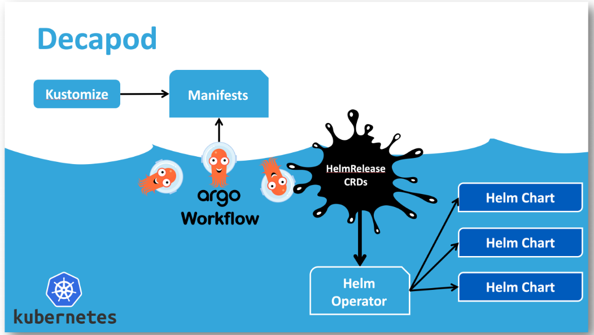

# SKT Cloud Technologies

클라우드 네이티브한 인프라에 대해서 설명한다.

### HA.NU(HAm Gye NUrim; 함께 누림) 프로젝트

오픈 인프라와 관련된 오픈소스 소프트웨어 기술들을 모아 제공하고, 확장시키기 위한 공간이며, 다양한 기업과 연구기관, 학교들과 함께 할 수 있도록 확장할 예정

### SKT Multi, Hybird Cloud 기술

#### **TACO**

오픈스택을 쿠버네티스로 구현하다가 컨테이너로 확장했으며, SKT 내부 상품들에 적용하여 상용화 시도를 하고 있다.

- T-map
- SKT Cloud

1. 2016년에 오픈스택을 어떻게 운영하고 쉽게 이용할 수 있을까?
   2017년까지 지속적으로 CI, Text Pipeline 등을 만들었다.
2. 왜 오픈소스 플랫폼에서 기술 공유하는 것이 중요할까?
   - 모여서 스케일 크게 만들 수 있다는 점
   - AT&T 와 협력하면서 기술적 향상을 이룰 수 있었음

### **Delarative, Cloud Native, Containerized, Kubernetes…**

서비스 어플리케이션보다는 인프라에 좀 더 집중을 가지므로써 차별성을 만들었는데,  쿠버네티스는 단순히 컨테이너라기보다는

- 분산시스템의 커널
- 모든것을 조율할 수 있는 조율자
- 모든 인프라의 라이프 사이클에 대한 관리자

등과 같은 다양한 기능들을 할 수 있다.

이러한 것을 이용하여 다양한 클라우드를 누구든 쉽게 관리할 수 있도록 선언적으로 만들 수 있다면 인프라를 관리/운용하는 데 있어서 쉽게 할 수 있다.

따라서, 이러한 기반 기술들을 만들기 위해서 다양한 기업들과 협력하며, 오픈 플랫폼에서 활동하며 기술 개발을 하고 있다.

### TACO 구조(OpenStack, Kubernetes)

**Multi-cluster Management Architecture**

- Privagte Cloud
  - Declarative Infrastructure Manager(Private Cloud)
    클라우드 인프라를 선언적으로 배포하기 위한 기술
- Hybrid Cloud
  - Declarative Infrastructure Manager
  - Declarative Application Manager

Control Center

- Platform Lifecycle Manager
- LMA
- Cloud Console

Service Clusters

Kubernetes on AWS

Usecase

- SKT Broadband

### Declarative Tool: Decapod

OpenStack 시스템은 구현하기 어려운 것으로 유명한게 DECADPOD로 손쉽게 이용할 수 있다.

